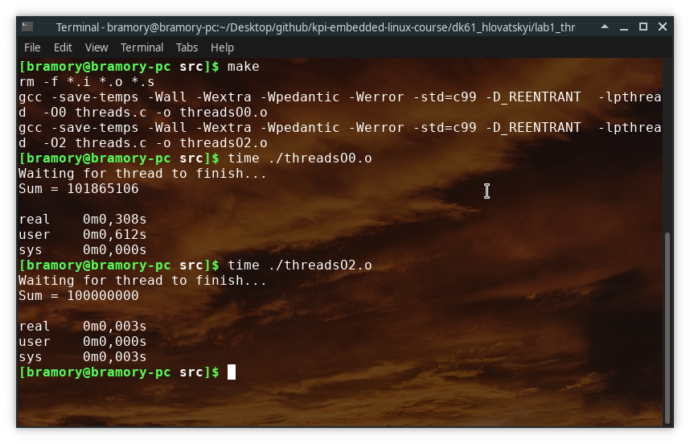
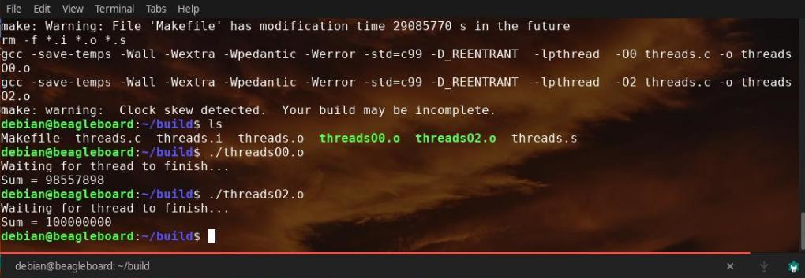

===========================
**Lab1: Threaded applications**
===========================

**Description**

That program creates N threads and increments a global variable by standalone function.

For compiling this code use command ``make <argument>`` from the directory where Makefile is located.
For showing executed time use command ``time <argument>``, 
where ``<argument>`` is output file, which was created after compilation.

**Explaining**

Results depends on compilatiom flags which are used during compilation.
Whether it's [-O0] - result is incorrect, executed time compare to O2
but with [-O2] - result is great, you can check the differences in asm code.

Results depend on compilation flags which are used during compilation.
Whether it's ``-O0`` - the result is incorrect, executed time compare to ``-O2``
but with ``-O2`` - the result is great, you can check the differences in asm code.

Wrong results happen 'cause two threads interrupt each other, there we have a race condition.
That may occur if a large amount of data are received at almost the same instant by a few threads, 
and the machine attempts to overwrite that data while it is being read
It fixes with mutex lock, which guarantees a correct result.

**Results**

You need to verificate your code and run it on different platforms.
That instance of code was run on x86 and the BeagleBoard, there we have:

As we see, the main difference made by optimizations, compiler changed the code for that specific
situation and just add the final score to the global variable. But embedded systems have a smaller
amount of memory and compare to the desktop computer or modern laptop. 
Pay attention for the final implementations of your programs and check uncommon situations,
make a fool-proofs and exclude memory leaks. 

**Contacts**

You can also contact me:

**Telegram:** @Bramory <https://tg.me/Bramory>

**E-mail** <glovatskiy.dmitriy@gmail.com>
