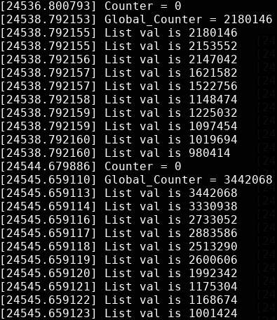
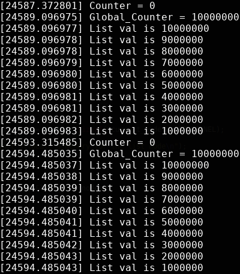

===========================
**Lab3: kernel_threads**
===========================

**Description**

In this work we need to implement own instance of the kernel module with 
dynamically allocated kernel threads and the struct of the lists.

**Explaining**

Dynamically allocate memory for the threads, variable and lists. 
This function that we neeed is declared in ``<linux/slab.h>:``
``void * kmalloc(size_t size, int flags)``

Later, when you no longer need the memory, do not forget to free it:
``void kfree(const void *ptr)``

The flags are broken up into three categories: action modifiers, zone modifiers, and types. 

**Action modifiers** specify **how** the kernel is supposed **to allocate** the requested memory. In certain situations, only certain methods can be employed to allocate memory. For example, interrupt handlers must instruct the kernel not to sleep (because interrupt handlers cannot reschedule) in the course of allocating memory. 

**Zone modifiers** specify **from where to allocate** memory. The kernel divides physical memory into multiple zones, each of which serves a different purpose. Zone modifiers specify from which of these zones to allocate. 

**Type flags specify a combination of action and zone modifiers** as needed by a certain type of memory allocation. Type flags simplify specifying numerous modifiers; instead, **you generally specify just one type flag**. The ``GFP_KERNEL`` is a type flag, which is used for code in process context inside the kernel. 

**Implementing**

We are wrote a code to process syncronized threads that have an access to the global variable and list to work with. After processing results are save to the nodes of the lists. 
To do that in a right way we need to use any syncronizing tools.
Spinlocks were implemented with atomic variables and funcions declared in <asm/atomic.h> which guarantee that only one thread can have an access to shared resources.     

**Module assembly and testing**

Use ``make`` to build a module
The main parts of the code are:

thread function - calculates the value with ``N_THREADS`` of threads by adding an ``increment`` on each step
spinlocks - provide correct results by blocking access to the variable for another threads, which are not use variable at that exact time 
lists -  contain data inside our predeclared structure 

We can declare the value of the:
``N_THREADS`` - amount of the threads to create
``increment`` - step for incrementing
``N_TIMES`` -  amount of steps to do adding

**Results**

You can see what we have without using spinlocks we have troubles :

But with spinlocks result is correct:

Just as in user-space, be careful to balance your allocations with your deallocations to prevent memory leaks and other bugs. Note, calling ``kfree(NULL)`` is explicitly checked for and safe.

Used sources:

<http://books.gigatux.nl/mirror/kerneldevelopment/0672327201/ch11lev1sec4.html>
<https://www.ibm.com/developerworks/ru/library/l-linux_kernel_71/>
<https://github.com/torvalds/linux/blob/master/include/linux/kthread.h>

**Contacts**

You can also contact me:

**Telegram:** @Bramory <https://tg.me/Bramory>

**E-mail** <glovatskiy.dmitriy@gmail.com>
