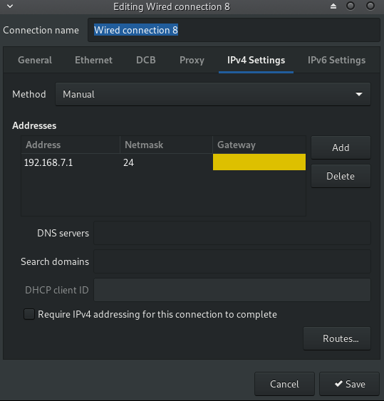
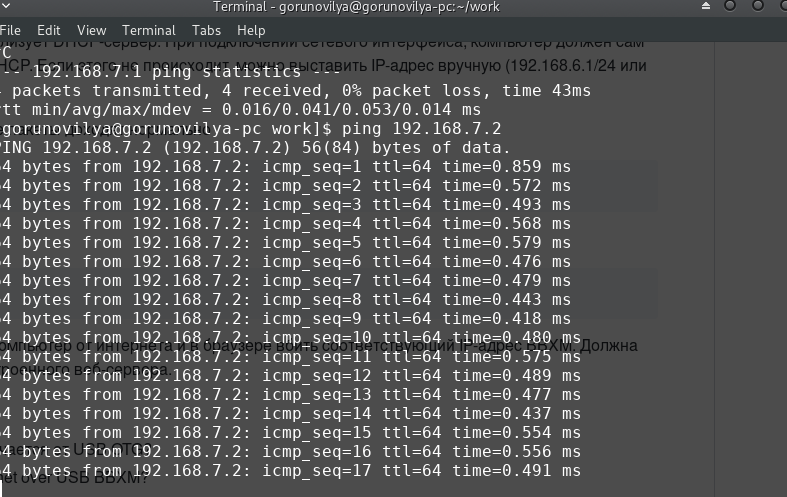
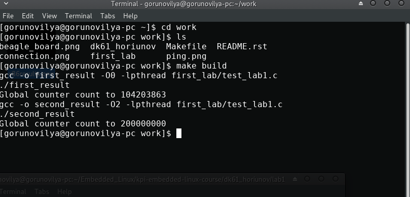
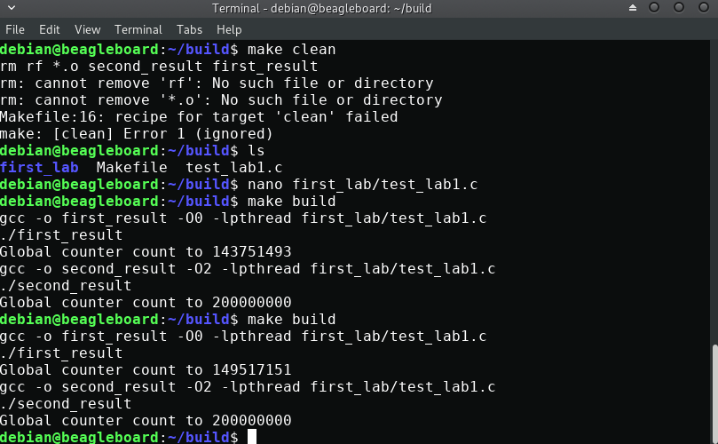
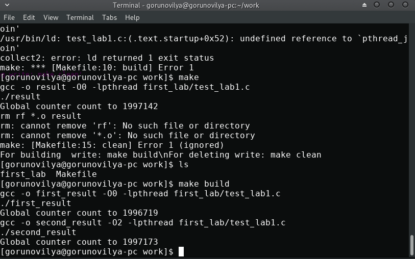

.. This report I have used as template from https://github.com/kpi-keoa/kpi-embedded-linux-course/blob/master/dk62_serhiienko/lab1_first_embedded_app/README.rst

Лабораторна робота №1.Багатопоточність.
---------------------------------------
Перша лабораторна робота присвячена вступу до курсу Embedded Linux 
та темі багатопоточності і складається з двох частин.

Завдання на першу частину
-------------------------

Завантажити та налаштувати Linux на платі Beagle Board:

* Выкачать последний оффициальный Debian Stretch for BeagleBoard образ
* Разархивировать и записать на SD-карту
* Подключиться к плате по USB
* Вставить SD-карту в BBXM и подключить питание
* С помощью команды ``lsusb``
* Проверить, что сетевые пакеты доходят нормально с помощью ``ping``
* Подключиться к BBXM по ssh

Завдання на другу частину
-------------------------

Потрібно написати програму, яка:

* запускает два потока (используя pthread);
* каждый поток увеличивает значение глобальной переменной на 1 в цикле 100000000 раз
* в конце делает join потоков и выводит полученное значение переменной
* собрать с флагами ``-O0`` и ``-O2`` для ``x86`` и для платы
* сравнить и объяснить полученные результаты

Виконання першої частини
------------------------
Перші пункти завдань з першої частини,на мою думку, не потребують описання так як виконуються
командами та їх результат очевидний.
У п'ятому пункті ми  можемо переконатися, що плата дійсно підключена і в шостому пункті ми пінгуємо
плату за адресою ``192.168.7.2`` так як адреса комп'ютера вручну була налаштована на ``192.168.7.1``.

Налаштування адреси

Перевірка та ``ping`` нашої плати

Виконання другої частини
------------------------
Для виконання другої частини була написана програма, яка використовує одну потокову функцію та запускає
її у двух потоках. У цій потоковій функції був реалізован звичайний лічильник, який рахує лише до 100000, так
як була додана функція для ``usleep()`` для того щоб дати проміжок часу коли потоки встигали б перемикатися
і результат був більш коректний. І при використанні цієї функції вираховування результату проходить досить довго.

Makefile
--------
Команди makefile:

- ``build`` - збирає та запускає проект
- ``clean`` - очищує всі об'єктні файли та виконавчий файл 
- ``all``   - запускає всі команди ``makefile``
- ``help``  - описання команд

Результати виконання на х86-архітектурі та платі Beagle Board
-------------------------------------------------

Архітектура х86
---------------

Нижче продемонстрований результат з оптимізацією ``-О0`` та ``-О2``.

Beagle Board
------------

Виведення результату з різними видами оптимізації ``-O0`` та ``-O2``

Функція ``usleep``
------------------

Висновки:
---------
На даній лабораторній роботі було виконано налаштування плати Beagle Board
та подальше порівняння інкрементації глобальної змінної у двох потоках на платі 
та на x86-архітектурі. Судячи з отриманих результатів при оптимізації
``-O0`` на arm і на x86 результати +- однакові і видно, що змінна, яка
повинна була приймати значення **200000000** - а приймає значно меньше.
Але при оптимізації ``-O2``, як на arm так і на x86 результат завжди один і
той же і дорівнює **20000000**. Це пов'язано з тим, що при оптимізації 
додавання в ассемблерних командах перетворюється з 3-х команд на одну і
потоки встигають коректно додавати значення при переключенні з одного на
інший. Також був проведених експеремент з функцією ``usleep()``, яка
викликалася кожен раз після ітерації для затримки i в свою чергу давала
можливість коректної ітерації під час перемикання між потоками.
Отриманий результат був досить цікавий, який я ,нажаль, поки що не можу
пояснити. Що при оптимізації ``-O0``,що при ``-O2`` результат був відмінний
від очікуваного. Результат можна побачити на рисунку вище.

