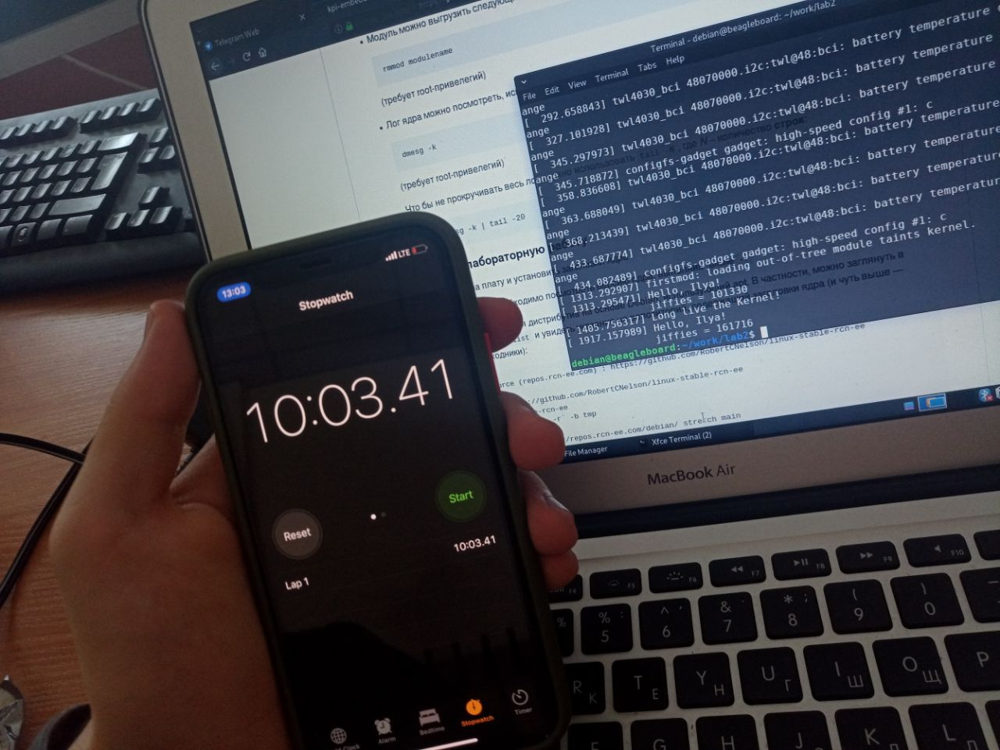
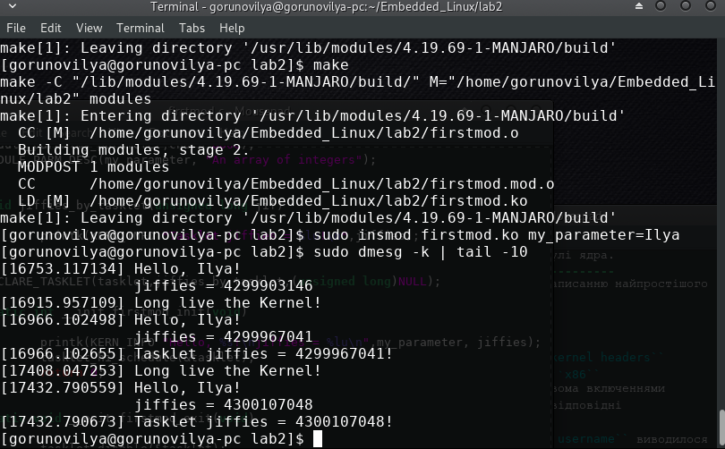

Лабораторна робота №2.Найпростіші модулі ядра.
----------------------------------------------
Друга лабораторна робота присвячена написанню найпростішого
модуля ядра і роботі з ним.

Завдання на лабораторну роботу
------------------------------
* Перенести на плату та встановити ``kernel headers``
* Зібрати модуль ядра на платі та на ``x86``
* Взяти секундомір. Засікти час між двома включеннями
модуля на ``x86`` і ``BBXM`` . Взяти відповідні
значення ``jiffies`` з логів.
* Виправити модуль, так щоб замість ``username`` виводилося
ім'я, яке передавалося в якості арумента
* Додати ``tasklet``, який би виводив значення ``jiffies``

Теоретична частина
------------------
- **jiffies** - глобальна змінна, яка містить кількість імпульсів системного таймера,які були отримані з часу завантаження системи. При завантаженні ядро встановлює значення цього параметра в нуль і він збільшується на одиницю при кожному перериванні системного таймера. Так як в секунду виникає ``HZ`` переривань системного таймера, то за секунду значення змінної ``jiffies`` збільшується на ``HZ`` . Тому час роботи системи (uptime) дорівнює ``jiffies / HZ`` секунд.
- **tasklet** - це щось на зразок дуже маленького потоку, у якого немає ні свого стека, ні контексту.Такі "потоки" відпрацьовують швидко і повністю. Різні ``tasklet`` можуть виконуватися паралельно, але при цьому сам з собою він одночасно не викликається, оскільки виконується тільки на одному ядрі,першим, який запланував його виконування. ``Tasklet`` виконуються за принципом невитісняючі планування,один за іншим, в порядку черги. Можна планувати з двома різними пріоритетами: ``normal`` і ``high`` .

Виконання та отримання результатів
----------------------------------

1. Спочатку були завантажені та встановлені ``kernel headers``
відповідно до тієї версії ядра, яка була встановлена на платі.

2.Після цього був підключений модуль та виведений результат
``jiffies``.

Результати виведеного ``jiffies``

2. Далі було виконане завдання з засіканням секундоміру між двома
повторними підключеннями модуля. Це було зроблено як на ``BBMX``, так
і на ``х86``. Повторне підключення модуля проводилося через 10 хвилин
після попереднього. Результати можна побачити нижче.

Архітектура х86
---------------

.. image:: doc/x86_jiffies.png

Beagle Board
------------

+--------------+---------------+------------+
|              |    x86	       |   BBMX     |
+==============+===============+============+
| First value  | 4 295 906 414 |  101 330   |
+--------------+---------------+------------+
| Second value | 4 296 088 017 |  161 716   |
+--------------+---------------+------------+
|    Delta     |    181 603    |   60 386   |
+--------------+---------------+------------+

3. Експерементально розрахований час, рівний 1 ``jiffies``.
Нижче можна побачити команду якою можна подивитися
значення ``HZ`` для системи. Було визначено, що:

+---------------+
| HZ_BBMX = 100 | 
+---------------+

+---------------+
| HZ_x86 = 300  | 
+---------------+

Значення ``jiffies`` у мілісекундах вираховується за наступною формулою:

+---------------------------------+
| jiffies_m = (DELTA * 1000) / HZ | 
+---------------------------------+

**Jiffies** у мілісекундах для х86-архітектури
----------------------------------------------
+----------------------------------------------+
| jiffies_m = (181 603 * 1000) / 300 = 605 343 | 
+----------------------------------------------+

**Jiffies** у мілісекундах для BBMX
-----------------------------------
+---------------------------------------------+
| jiffies_m = (60 386 * 1000) / 100 = 603 830 | 
+---------------------------------------------+

4. Наступним кроком було завдання в якому потрібно було виводити 
``username`` в якості аргументу. Для цього використовуються макроси
такі,як ``module_parm()`` , ``module_parm_array`` та макрофункції ``MODULE_PARM_DESC()`` .
Аргумент,що передається, може бути об'явлений різними типами даних. У моєму
варіанті це був тип ``char`` . Команда, яка використовується для імпорту модуля
наведена нижче, де ``my_parameter`` це змінна у яку я передаю свій аргумент ``Ilya_x86``

.. code-block::

sudo insmod firstmod.ko my_parameter=Ilya_x86 

5. Останнім пунктом було вивести ``jiffies`` за допомогою ``tasklet`` .
Результати можна побачити нижче.

Висновки
--------
Беручи до уваги, те що 10 хвилин це 600 000 мс., отримані результати майже повністю
збігаються з теоретичними. Також було виведено значення ``jiffies`` як за допомогою
макросів для **parsing command line arguments** так і за допомогою ``tasklet``.
Результати виявилися теж однаковими.В своєму завданні, я використав планування з різним пріорітетом,
але якоїсь очевидної різниці не побачив. Для цього я використовував макроси ``tasklet_schedule`` і
``tasklet_hi_shedule``.
