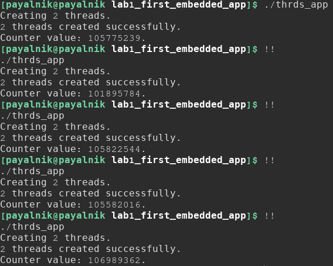
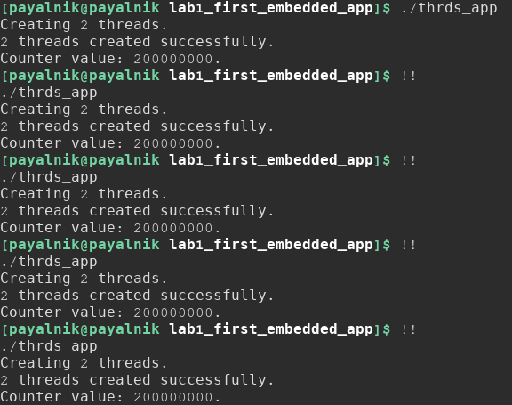
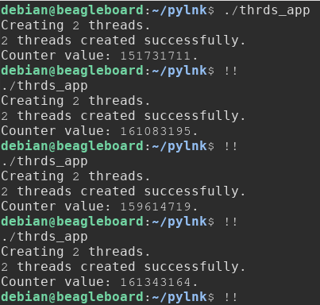
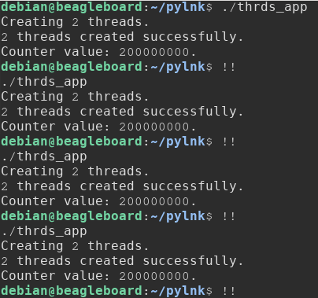

==================================================
Лабораторна робота #1. Перший Embedded-застосунок.
==================================================

Завдання
--------
Завданням, поставленим в даній лабораторній роботі, було написання програми, яка:

- Містить глобальну змінну (початково ініціалізується значенням ``0``);
- Запускає два потоки ``pthread``;
- Кожен потік в циклі інкрементує значення глобальної змінної ``100 000 000`` разів;
- Чекає закінчення потоків, використовуючи ``join``;
- Виводить підсумкове значення глобальної змінної в ``stdout``;

Також потрібно було написати ``Makefile``, зібрати програму з прапорцями ``-O0`` та ``-O2`` на **x86** та **BBXM**, багатократно її запустити, порівняти, проаналізувати та дати пояснення отриманим результатам.

Опис реалізації
---------------
Файл з вихідним кодом проекту знаходиться в директорії ``src``. 

Глобальною змінною, значення якої буде інкрементуватись, виступає змінна ``counter``. Інкрементування значення даної змінної здійснюється у функції ``thread_counter``. Значення кількості інкрементів змінної ``counter`` зберігається в вигляді константи ``cnt_end``.
Значення кількості потоків, які будуть створюватись, зберігається в вигляді константи ``threads_amt``. Змінна ``thrd_status`` потрібна для збереження в ній значення статусу виконання операцій, пов'язаних з роботою потоків. В масиві ``threads`` типу ``pthread_t`` зберігаються ідентифікатори створюваних потоків.

Загалом, робота програми відбувається наступним чином: спершу користувачу виводиться повідомлення про створення ``threads_amt`` потоків. Далі, за допомогою циклу ``for`` та функції ``pthread_create`` з бібліотеки *pthread*, відбувається створення заданої кількості потоків, всередині яких відбувається виклик функції ``thread_counter``. При цьому також відбувається перевірка статусу виконання функцї ``pthread_create``, шляхом порівняння значення, яке вона поверне в результаті виклику, зі значенням ``0``, повернення якого свідчить про успішне її виконання. Якщо значення ``thrd_status`` буде відмінним від нуля, буде виведено повідомлення про помилку при створенні потоків, а також статус виконання функції ``pthread_create``, після чого робота програми завершиться за допомогою виклику функції ``exit`` з кодом ``EXIT_FAILURE``.
Після успішного створення потоків, виводиться відповідне повідомлення.
Далі, шляхом виклику в циклі ``for`` функції ``pthread_join``, відбувається очікування завершення виконання створених раніше потоків. Також, як і при створенні потоків, відбувається перевірка рівності нулю значення, яке повернула функція ``pthread_join``, що свідчить про успішне її виконання. Якщо ж отримане значення ``thrd_status`` буде відмінним від нуля, буде виведено повідомлення про помилку виконання ``pthread_join``, а також статус виконання даної функції, після чого відбудеться завершення роботи програми зі статусом ``EXIT_FAILURE``.
Після успішного закінчення виконання створених потоків, відбувається виведення підсумкового значення глобальної змінної ``counter``. 

Збірка проекту
-------------- 
Для збірки проекту був написаний ``Makefile``.
Makefile являє собою файл, що містить набір вказівок-інструкцій для утиліти **make** про те, яким чином збирати проект.

Реалізований в рамках даної лабораторної роботи Makefile має наступні опції запуску, так звані *цілі збірки*: ``all``, ``asm``, ``help``, ``clean``. 
Також передбачена можливість передавання у вигляді аргумента командної строки значення прапорця оптимізації для компілятора, з яким користувач бажає зібрати даний проект.

Першою ціллю в даному Makefile є ціль ``help``, яка буде виконуватись за замовчуванням, якщо утиліті ``make`` не було явно передано інакшої опції. При цьому буде виведена довідкова інформація про те, як користуватись даним Makefile.
Таким чином, щоб зібрати проект з, наприклад, оптимізацією ``-O2``, потрібно виконати в терміналі наступну команду: ``make all OPTFLAG=-O2``. Після цього можна запустити виконання програми за допомогою команди ``./thrds_app``.
Для того, щоб переглянути асемблерні лістинги програми, зібраної з оптимізацією ``-O2``, потрібно виконати: ``make asm OPTFLAG=-O2``.
Якщо явно не вказувати бажаний рівень оптимізації, і збирати проект командою ``make all``, або ж ``make asm``, при компіляції проекту буде використано рівень ``-O0``, як рівень оптимізації за замовчуванням для компілятора **gcc**.
Для видалення результатів збірки можна скористатись командою ``make clean``. 

Аналіз результатів виконання програми
-------------------------------------
При багатократних запусках програми на платформі **x86**, було отримано наступні підсумкові значення глобальної змінної, яка інкрементувалась в потоках:

+-----+------------------------------------------+
|**#**|**Підсумкове значення глобальної змінної**|
|     +------------------------------------------+
|     |          **Рівень оптимізації**          |
|     +----------------------+-------------------+        
|     |          **-O0**     |        **-O2**    |            
+-----+----------------------+-------------------+
|**1**| 105775239            | 200000000         |
+-----+----------------------+-------------------+
|**2**| 101895784            | 200000000         |
+-----+----------------------+-------------------+
|**3**| 105822544            | 200000000         |
+-----+----------------------+-------------------+
|**4**| 105582016            | 200000000         |
+-----+----------------------+-------------------+
|**5**| 106989362            | 200000000         |
+-----+----------------------+-------------------+

При запусках програми на платформі **BBXM**, результати виконання були наступними:

+-----+------------------------------------------+
|**#**|**Підсумкове значення глобальної змінної**|
|     +------------------------------------------+
|     |          **Рівень оптимізації**          |
|     +----------------------+-------------------+        
|     |          **-O0**     |        **-O2**    |            
+-----+----------------------+-------------------+
|**1**| 151731711            | 200000000         |
+-----+----------------------+-------------------+
|**2**| 161083195            | 200000000         |
+-----+----------------------+-------------------+
|**3**| 159614719            | 200000000         |
+-----+----------------------+-------------------+
|**4**| 161343164            | 200000000         |
+-----+----------------------+-------------------+
|**5**| 159121845            | 200000000         |
+-----+----------------------+-------------------+

Пояснити невідповідність результатів виконання програми очікуванням при відсутності оптимізації можна неатомарністю інструкцій і відсутністю застосування механізмів синхронізації потоків в даній реалізації поставленого завдання. Під атомарністю інструкції мається на увазі її *неподільність* — при програмуванні мікроконтролерів, зокрема, атомарність інструкції полягає в тому, що її виконання не може бути перерваним, наприклад, перериванням, яке надійшло.
Справа в тому, що, в даному випадку, операція інкременту глобальної змінної ``counter`` відбувається "не цілісно" — тобто, являє собою послідовне виконання *кількох* інструкцій — при виконанні програми спочатку відбувається зчитування поточного значення даної змінної, потім відбуваєтся її інкремент — значення збільшується на одиницю — і тоді модифіковане значення зберігається в пам'яті.
За рахунок відсутності застосування механізмів синхронізації роботи потоків, відбувається ситуація, коли дана послідовність "зчитування значення змінної — інкремент — зберігання в пам'яті" переривається на якомусь з цих етапів, при перемиканні роботи потоків.
Щоб цього уникнути, потрібно синхронізувати їх роботу, і забороняти доступ до модифікації змінної іншому потоку, до того моменту, поки перший потік не завершив виконання необхідної інструкції.

Що до результатів, які були отримані при застосуванні оптимізації ``-O2``, можемо спостерігати повну їх відповідність очікуванням. Така точність може бути пояснена тим, що компілятор, виконуючи оптимізацію, заміняє послідовну інкрементацію змінної ``counter``, яка відбувається в циклі ``for``, на наступну, у випадку платформи **x86**, інструкцію, яка встигає виконатись дуже швидко, і виконання якої, тому, не переривається при перемиканні роботи потоків:

.. code-block:: C

  addq	$100000000, counter(%rip)

Аналогічна ситуація в плані оптимізації має місце і при компіляції проекту на **BBXM**.

