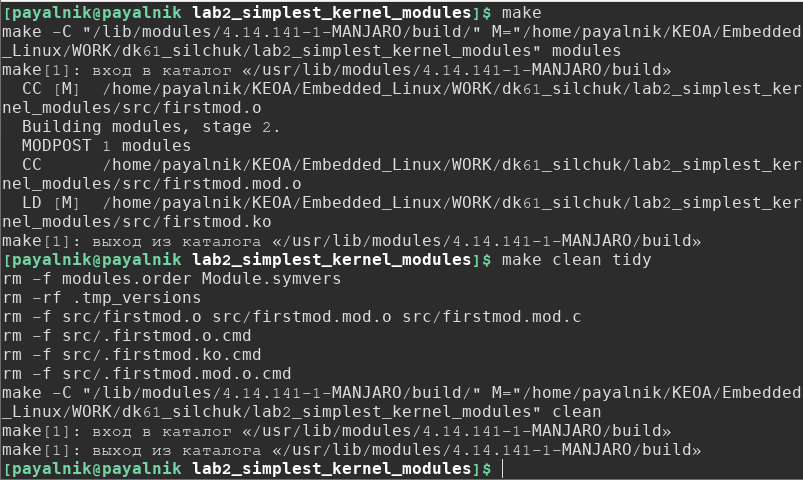
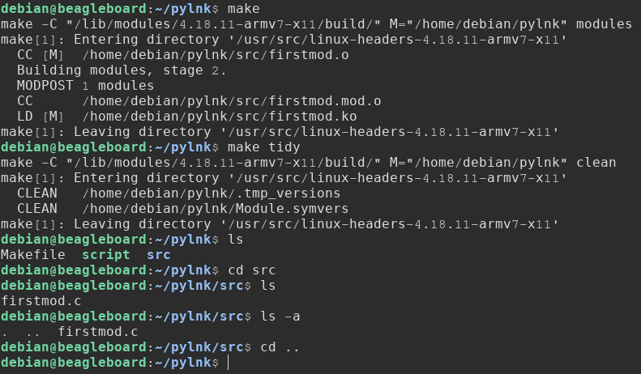
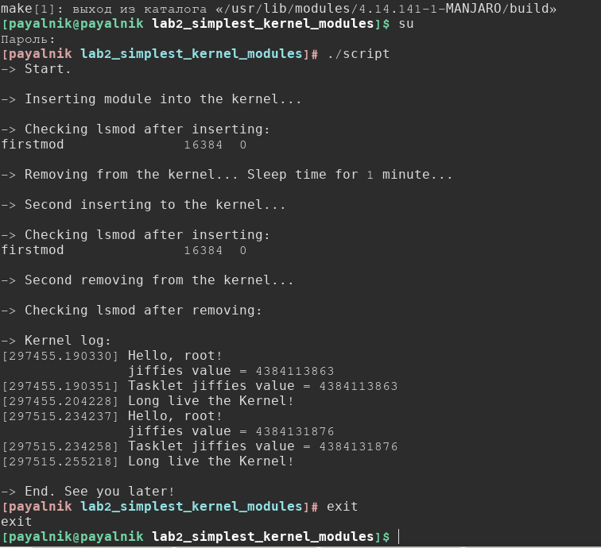
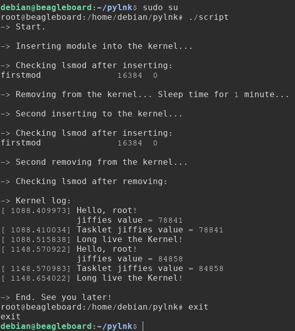
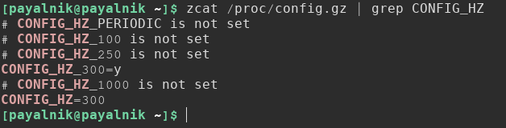
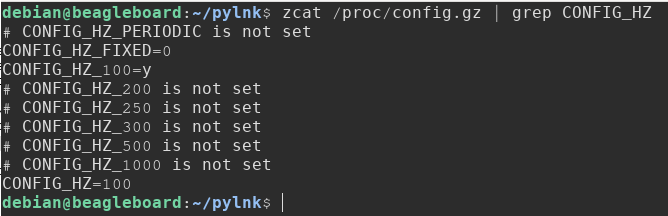

===========================================================
Лабораторна робота #2. Написання найпростіших модулів ядра.
===========================================================

Завдання
--------
Завданням, поставленим в даній лабораторній роботі, було:

- Зібрати модуль ядра, наведений в директорії `demo/lab1 <https://github.com/kpi-keoa/kpi-embedded-linux-course/tree/master/demo/lab1>`_ на **x86** та **BBXM**. Після кожного підключення та відключення модуля до/від ядра, дивитись логи ядра (краще всього, використовуючи ``dmesg``);
- Взяти секундомір, засікти час між двома включеннями модуля на **x86** та **BBXM**. Взяти відповідні значення ``jiffies`` з логів. Перевірити, чи залежить різниця в двох значеннях ``jiffies`` від платформи. Обґрунтування включити в протокол по роботі;
- Експериментально розрахувати час (в мілісекундах), рівний ``1`` ``jiffies``. Порівняти з `теоретичним <https://stackoverflow.com/questions/12480486/how-to-check-hz-in-the-terminal/57879202#57879202>`_ значенням. Результати включити в протокол;
- Доповнити реалізацію модуля, наведеного у якості прикаладу таким чином, щоб замість ``$username``, виводилось ім'я, передане в якості параметра модуля, при його підключенні за допомогою ``insmod``; 
- Додати в ``init`` отриманого модуля ``tasklet``, який також виводитиме поточне значення ``jiffies``;
- Пояснити, чому різниця між двома значеннями ``jiffies``, що виводяться (в ``init`` та в ``tasklet``'і), може бути рівною ``0``, ``1`` або ``2``; 

Теоретичні відомості та опис реалізації
---------------------------------------
Вихідний код проекту знаходиться в директорії ``src``. 

**Завантажувані модулі ядра**

Linux - ОС з монолітним модульним ядром, тобто підтримкою архітектури підвантажуваних модулів ядра.
Модулі дозволяють розширити функціональність ядра без потреби перезавантаження системи, і без потреби повторної збірки ядра, що є характерним для монолітних ядер без підтримки підвантажуваних модулів.
Модульне ядро ділиться на окремі завантажувані модулі ядра, причому в оперативну пам'ять вони можуть завантажуватись як всі разом, так і окремо.
Однак, як і в випадку монолітного ядра, всі модулі ядра знаходяться в спільному адресному просторі, і виконуються в режимі ядра, тобто, не витискаються іншими процесами.

В основному, робота з модулями ядра виконується за допомогою таких команд, як ``insmod``, для завантаження модуля, ``rmmod``, для вивантаження модуля, ``lsmod``, для перегляду завантажених модулів, та ``modinfo``, для перегляду інформації про модуль. 

Ключовими функціями при написанні модулів ядра є функції завантаження та вивантаження — ``init`` та ``exit``, тобто функції, які виконуються при завантаженні та вивантаженні модуля за допомогою ``insmod``/``rmmod``.
В модулі, який був реалізований в рамках даної лабораторної роботи, такими функціями є ``static int __init firstmod_init(void)`` та ``static void __exit firstmod_exit(void)``. Шляхом використання макросів ``module_init`` та ``module_exit``, та вказання функцій завантаження-вивантаження, була також отримана можливість довільного найменування цих функцій. 

Як видно, ``init``-``exit``-функції є статичними — статичні функії є доступними тільки в тому модулі, де вони визначаються. Також такий підхід дозволяє існування в іншому модулі функції з таким же іменем.

Використання макросу ``module_param`` дозволяє передавати модулю аргументи командного рядка.
Макрос ``MODULE_PARM_DESC`` дає можливість зручного документування аргументів, які приймає модуль. Ім'я та короткий опис задокументованих таким чином параметрів будуть виводитись при перегляді інформації про модуль за допомогою ``modinfo``. 

**Багатозадачність, переривання та tasklet'и в ядрі Linux**

``Tasklet``'и в Linux використовуються для відкладеної обробки переривань. 

Апаратне переривання (``IRQ`` — Interrupt Request) — це зовнішня асинхронна подія, котра надходить від апаратури, призупиняє хід програми та передає керування процесору для обробки даної події. 

Процедура обробки переривань ділиться на дві частини - ``top-half`` та ``bottom-half``. 
Top-half — це функція-обробник переривання (``ISR`` — Interrupt service routine), що викликається при перериванні, відпрацьовує максимально швидко, і виконує необхідні процедури для подальшого переходу до другої частини — bottom-half. Вимога, котра стосується максимальної швидкості виконання top-half процедур, пов'язана з тим, що в цей час апаратні переривання є вимкненими.
Bottom-half — більш довготривала процедура, на яку приділяється основна частина процедур обробки переривань, яка виконується, при цьому, при дозволених апаратних перериваннях. 

Tasklet'и, про які йтиме мова далі, стосуються саме bottom-half, відкладеної частини обробки переривань, для якої в Linux використовуються tasklet'и та workqueue.

Структура ``tasklet_struct`` визначена в ``<linux/interrupt.h>``, і має наступний вигляд:

.. code-block:: C  

  struct tasklet_struct
  {
	struct tasklet_struct *next;  // наступний tasklet в черзі на планування 
	unsigned long state;          // TASKLET_STATE_SCHED або TASKLET_STATE_RUN 
	atomic_t count;               // відповідає за те, активований tasklet, чи ні 
	void (*func)(unsigned long);  // основна функція tasklet’а 
	unsigned long data;           // параметр, який передається функції func 
  };

Перш за все, потрібно задекларувати тасклет. Для цього було використано макрос ``DECLARE_TASKLET(jffs_tasklet, jffs_tasklet_func, 0)``.
Таким чином, буде створена тасклет-структура з іменем ``jffs_tasklet``, в якості основної функції тасклета виступатиме функція ``jffs_tasklet_func``, яка виконує виведення, за допомогою ``printk``, поточного значення ``jiffies``, і якій, при цьому, передаватиметься значення ``0``. 

Після декларування тасклету, його можна запланувати, і він, таким чином, поміститься в чергу на виконання.
Виконується це за допомогою функції ``tasklet_schedule(&jffs_tasklet)``. При цьому даному тасклету буде присвоєно звичайний пріоритет у черзі. Можливе також планування тасклетів з високим пріоритетом виконання, а також тасклетів з позачерговим виконанням.

Після того, як тасклет буде виконаним, він "вбивається" за допомогою функції ``tasklet_kill(&jffs_tasklet)`` в ``exit``-функції модуля. 

**Jiffies та CONFIG_HZ**

``Jiffies`` — глобальна змінна, оголошена в файлі ``<linux/jiffies.h>`` у вигляді ``extern unsigned long volatile jiffies``, яка містить кількість імпульсів системного таймера, які були отримані з моменту завантаження системи. При завантаженні ядро встановлює дане значення в нуль, і воно збільшується на одиницю при кожному перериванні системного таймера.

``HZ`` — кількість переривань системного таймера, які виникають за секунду. 
Значення HZ, що використовується в системі, можна дізнатися за допомогою команди:
``zcat /proc/config.gz | grep CONFIG_HZ``

Таким чином, час роботи системи (uptime) рівний ``jiffies / HZ`` секунд.

Збірка проекту
-------------- 
Для збірки проекту використовується ``Makefile``. 
Для того, щоб зібрати модуль, можна скористатись командою ``make``, або ж ``make modules``, з явним вказанням необхідної цілі збірки. 
Для очистки директорії від файлів-результатів збірки, можна скористатись ``make clean`` або ``make tidy``. 
``make clean`` залишить в директорії ``src`` зібраний модуль ``firstmod.ko``, видаливши всі інші результати збірки, ``make tidy`` же виконає більш "глибоке" очищення, видаливши також і зібраний модуль.

Збирання проекту та подальша очистка директорії від файлів-результатів збірки виглядає, загалом, наступним чином:

**x86:**

**BBXM:**

Виконання програми. Bash-скрипти
--------------------------------
Командний рядок Linux дозволяє виконувати кілька команд послідовно, шляхом введення їх через символ ``;``, наприклад, наступним чином:
``echo "Hello, "; echo "World!"``

Це, загалом, доволі зручно, так як можна одразу задати весь ланцюжок необхідних інструкцій і відправити їх на виконання. 
Але, все ж, зручніше, замість введення необхідної, ймовірно, довгої, послідовності інструкцій, щоразу, коли в її виконанні є потреба, було б одноразово зберегти її в одному файлі, і в подальшому виконувати необхідні послідовності інструкцій, викликаючи виконання даного файлу.

Такі файли, що містять послідовності команд для виконання в командному рядку, мають назву *сценарії командного рядка*.

Створений файл сценарію має назву ``script``. Для того, щоб запустити його виконання, потрібно спершу зробити даний скрипт виконуваним, скориставшись наступною командою:

``chmod +x ./script``

Після чого можемо його виконати, враховуючи, при цьому, потребу в увімкненому режимі суперкористувача, для коректної роботи інструкцій, що стосуються завантаження/вивантаження модуля до/від ядра, а також для перегляду логів ядра за допомогою ``dmesg``. Для того, щоб зробити відсутньою потребу постійного введення паролю для доступу до режиму суперкористувача, можна одноразово перейти в цей режим перед запуском виконання скрипту, і вийти з даного режиму по завершенню виконання необхідних команд:

``su``

``./script``

``exit``

Загалом, даний сценарій командного рядка реалізує послідовне виконання наступних інструкцій: завантаження створеного в результаті роботи утиліти ``make`` модулю ``src/firstmod.ko`` до ядра за допомогою ``insmod``, а також передача модулю імені користувача, отриманого за допомогою команди ``whoami``, в якості ``arg_username``, перевірка наявності його в списку завантажених на даний момент модулів за домогою ``lsmod`` та пошуку необхідної назви в результатах виводу даної команди за допомогою ``grep``, вивантаження модуля від ядра за допомогою ``rmmod``, однохвилинну затримку перед виконанням наступної команди, реалізовану за допомогою утиліти ``sleep``, повторне завантаження модуля до ядра, перевірку його наявності його в списку завантажених модулів, вивантаження модуля від ядра, перевірка його наявності в списку завантажених модулів після його вивантаження, щоб впевнитись в коректному вивантаженні модуля, вивід останніх 8 рядків логів ядра за допомогою ``dmesg`` та опції ``tail -8``. 

Аналіз результатів виконання програми
-------------------------------------
В результаті виконання роботи модулів на платформах **x86** та **BBXM**, було отримано наступні результати:

+-----+---------------------------------------------------+
|**№**|**Значення jiffies, отримане за допомогою tasklet**|
|     +----------------------+----------------------------+        
|     |        **x86**       |          **BBXM**          |            
+-----+----------------------+----------------------------+
|**1**| 4384113863           | 78841                      |
+-----+----------------------+----------------------------+
|**2**| 4384131876           | 84858                      |
+-----+----------------------+----------------------------+
|**Δ**| 18013                | 6017                       |
+-----+----------------------+----------------------------+

**x86:**

**BBXM:**

Проміжок часу ``Δt`` між двома включеннями модуля для обох платформ є рівним 1 хвилині (60 с = 60000 мс).

Дізнаємось, чому в даному випадку рівне значення ``HZ`` на платформах **x86** та **BBXM**:

**x86:**

**BBXM:**

Отже, маємо наступні результати:

- ``x86``: ``CONFIG_HZ=300``.
- ``BBXM``: ``CONFIG_HZ=100``.

Отже, у випадку платформи **x86**, за 1 секунду (1000 мс) виникає 300 переривань системного таймера, відповідно, значення змінної jiffies збільшується на 300. Таким чином, знайти час, за який значення змінної jiffies збільшується на 1 — тобто, час ``1`` ``jiffies``, можна:

``1 jiffies = 1000 / 300 = 3.333 (мс)``

Для **BBXM** дане значення рівне:

``1 jiffies = 1000 / 100 = 10 (мс)``

Експериментальні значення часу, за який значення змінної jiffies змінюється на 1:

- **x86**: ``1 jiffies = Δt / Δ = 60000 / 18013 = 3.331 (мс)``
- **BBXM**: ``1 jiffies = Δt / Δ = 60000 / 6017 = 9.971 (мс)``

Відповідно, виходячи з вищенаведених міркувань, за 1 хвилину лічильник jiffies, теоретично, має збільшуватись на значення:

- **x86**: ``300 * 60 = 18000``
- **BBXM**: ``100 * 60 = 6000``

**Висновки**: Як видно, експериментальні значення дещо відмінні від теоретичних. Пояснити дану похибку можна тими витратами часу, які необхідні на виконання процедури завантаження-вивантаження модуля (``insmod``/``rmmod``), а також на виконання виведення повідомлень за допомогою ``echo``, які вібуваються між запусками роботи модуля.
Що до співпадіння значень jiffies, які виводяться за допомогою тасклету та безпосередньо в модулі, це можна пояснити простотою модуля, що забезпечує відсутність сильної завантаженості системи, тому дані функції виведення значення jiffies встигають відпрацювати дуже швидко, до інкременту змінної-лічильника jiffies.

Використані матеріали:
----------------------
- `The Linux Kernel Module Programming Guide <https://www.tldp.org/LDP/lkmpg/2.6/html/index.html>`_;
- `Bash-скрипти <https://habr.com/ru/company/ruvds/blog/325522/>`_;
- `Многозадачность в ядре Linux: прерывания и tasklet’ы <https://habr.com/ru/company/embox/blog/244071/>`_;
- `Переменная jiffies <https://it.wikireading.ru/1849>`_;