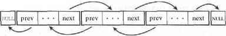

==========================
Звіт з лабораторної роботи
==========================
Лабораторна робота №3: "Потоки ядра"
__________________________________________________________

Зміст
_____
	#. `Завдання`_
	#. `Теоритичні відомості`_
		#. `Механізм потоків ядра`_
		#. `Списки в ядрі Linux`_
		#. `Функція kmalloc()`_
		#. `Атомарні операції`_
	#. `Хід роботи`_
		#. `Реалізація потоків`_
		#. `Реалізація списків`_
		#. `Робота з atomic_t`_

Завдання
~~~~~~~~

**Написать модуль ядра, который:**
  * содержит переменную
  * запускает M потоков на одновременное выполнение
  * каждый поток инкрементирует переменную N раз, кладет значение переменной в список и завершается
  * при выгрузке модуль выводит значение переменной и содержимое списка
  * использовать параметры модуля для задания инкремента N и количества потоков M
    (в коде параметры должны называться осмысленно)
  * для переменной, списка, потоков использовать динамическую аллокацию. Переменную передавать в поток по ссылке аргументом	
* Реализовать функции lock() и unlock() с использованием атомарных операций ядра (asm/atomic.h, отличается в зависимости от архитектуры). 
* Необходимо учитывать и корректно отрабатывать возможные ошибки. Например, kmalloc может не выделить память. 

Теоритичні відомості
~~~~~~~~~~~~~~~~~~~~

Механізм потоків ядра
"""""""""""""""""""""

*Що таке ядро?* Було розглянуто в `попередній л.р. <https://github.com/kpi-keoa/kpi-embedded-linux-course/blob/master/dk62_dovzhenko/lab2_simplest_kernel_modules/README.rst>`_

Часто в ядрі корисно виконати деякі операції у фоновому режимі. В ядрі така можливість реалізована за допомогою потоків простору ядра *kernel thread* - звичайних процесів, які виконуються виключно в просторі ядра.

**Механізм потоків ядра** (kernel thread - з'явився, починаючи з версії ядра 2.5) надає мажливості для паралельного виконання завдань в ядрі.

**Реалізація потоків в ядрі Linux**

Реалізація потоків в операційній системі Linux є унікальною, оскільки для такого ядра не існує як такої окремої концепції потоків. В ядрі Linux потоки реалізовані так само, як і *звичайні процеси*.

**Поток** - це такий процес, який використовує деякі ресурси разом із іншими процесами.

Реалізація потоків виконана нижче - `Реалізація потоків`_.

Списки в ядрі Linux
"""""""""""""""""""
Ядро linux написано переважно на мові С.

Раніше в ядрі було кілька реалізацій зв'язних списків. Проте для того, щоб прибрати різний код, який виконує однакові дії, потрібно, щоб існувала єдина реалізація списків. Під час розробки серії *ядер 2.1* була запропонована єдина реалізація зв'язаних списків в ядрі. Сьогодні у всіх підсистемах ядра використовується офіційна реалізація(циклічний двухзв'язний список).

**Зв'язаний список** - це структура зберігання інформації (контейнер), яка може містити змінну кількість елементів даних, що їх називають вузлами, і дозволяє маніпулювати цими даними.

Двохзв'язні списки *(doubly linked)* містять вказівник не лише на наступний елемент *next*, але й на попередній *prev*. 

Останній елемент зв'язаного списку не має наступного за ним елемента, і значення вказівника *next* останнього елемента зазвичай встановлюється рівним спеціальному значенню *NULL*, для того щоб показати, що цей елемент списку є останнім. В деяких випадках останній елемент списку не вказує на спеціальне значення, а вказує на перший елемент цього ж списку. Такий список називається **циклічним зв'язаним списком (circular linked list)**, оскільки зв'язок утворюють на кштал кільця.

  
  
Детальніше реалізація списків в даній лабораторній роботі розглянута в `Реалізація списків`_.

Функція kmalloc()
"""""""""""""""""

**Функція kmalloc()** - це простий інтерфейс для виділення в ядрі ділянок пам'яті розміром в задану кількість байтів.
Дана функція визначена у файлі ``<linux/slab.h>``.
Першим аргументом *kmalloc* є розмір блоку, який буде виділений. Другий аргумент, прапори виділення, вони контролює поведінку *kmalloc*.
Найбільш часто використовуваний флаг, **GFP_KERNEL**, означає, що виділення проводиться від імені процесу, запущеного в просторі ядра.

Приклад виділення памʼяті:

.. code-block:: c

	struct dog *d = kmalloc(sizeof *d, GFP_KERNEL);

Якщо дана функція **kmalloc()** спрацювала успішно, то зміна **ptr** буде вказувати на область пам'яті, розмір якої більше за вказане значення або дорівнює йому.  Відповідно, якщо **ptr = NULL** то буде помилка, про яку необхідно повідомити.

.. code-block:: c

	if (!ptr) goto Error;
	Error: printk(KERN_ERR "Kmalloc didnt allocate memory!\n"); 

Атомарні операції
"""""""""""""""""

Засоби виконання атомарних операцій з цілими числами працюють з типом даних **atomic_t**. Замість того, щоб використовувати функції, які працюють безпосередньо з типом даних **int** мови С, через деякі причини використовується спеціальний тип даних. 

* По-перше, функції, які виконують атомарні операції, приймають тільки аргументи типу **atomic_t**, це гарантує, що атомарні операції виконуються **тільки з даними цього спеціального типу**. У той же час це також гарантує, що дані цього типу не зможуть передаватися в інші функції, які не виконують атомарних операцій. 

* По-друге - використання типу **atomic_t** дозволяє гарантувати, що компілятор (помилково, але для підвищення ефективності) не буде оптимізувати операції звернення до атомарних змінних. Важливо, щоб атомарні операції отримували правильне значення адреси змінної в пам'яті, а не адреси тимчасових копій.

Все, що необхідно використовувати для атомарних операцій, знаходиться у файлі `` <asm/atomic.h>``. 

При динамічних алокаціях декларація змінних типу **atomic_t** виконується звичайним чином. 

.. code-block:: c

	atomic_t *arg; 

Хід роботи
~~~~~~~~~~

Реалізація потоків
""""""""""""""""""

Для роботи з потоками (kthread) необхідно заінклудити ``#include <linux/kthread.h>``.

Кожен поток має структуру ``task_struct``, і як вже говорилося поток представляється для ядра звичайним процесом (який спільно використовує ресурси, такі як адресний простір, з іншими процесами).

У функції ініціалізації модуля ``static int __init kmod_init(void)`` необхідно запустити новий потік за допомогою функції ``kthread_run``.

.. code-block:: c

	kthread_run(&thread_func, (void *)cnt, "thread_%d", i);

де, є такі аргументи:
	* *thread_func* - функція, яку потрібно запустити;
	* *(void *)cnt* - дані, яку хочемо передати у функцію;
	* *"thread_%d", i* - ім'я для потоку.

Також дана функція, поверне вказівник на створений поток, який оголошується наступним чином:

.. code-block:: c
	
	struct task_struct *task;

	
В функції потока ``int thread_func(void *data)`` реалізовано цикл, який збільшує перемінну ``cnt`` на ``incr_val`` разів.

В ролі розподільника задач обрано функцію ``schedule()``. Планувальник послідовно переключає процеси, даючи можливість кожному з них на якийсь час скористатися центральним процесором в своїх цілях.

Реалізація списків
""""""""""""""""""

Для реалізація циклічного двусвязного списку на *С* потрібно підключити ``#include <linux/list.h>``.

Даний файл визначає просту структуру типу *list_head*

.. code-block:: c

  struct list_head {
    struct list_head *next, *prev;
  };

Зв'язні списки, які використовуються в реальному коді, складаються зі структури одного типу, кожна з яких описує один запис в списку. Для використання в нашому коді засоби списку Linux, необхідно лише додати *list_head* всередині структур, що входять до вже заданого списку. 

.. code-block:: c

  struct struct_for_res {
	struct list_head list;
	int num;
  };
	
``INIT_LIST_HEAD(&main_struct.list);`` - такий макрос оголошує змінну типу *struct list_head* з вказаним ім'ям, а також ініціалізує її.
Замість даного макроса, можна використати *LIST_HEAD(mylist)*.

Для того, щоб додати новий елемент *struct_ptr* в список потрібно використовувати: ``list_add(&struct_ptr->list, &main_struct.list);``.
Також є можливість добавляти нові елементи в "хвіст" списка, для цього є функція: ``list_add_tail()``.

В коді також використовується макрос ``list_for_each()``.  Він дозволяє реалізувати цикл проходження по елементам списку. Перший аргумент використовується, як лічильник. Тобто він використовується, для того щоб показати на поле типу *list_head* даного елемента списку. Другий аргумент - вказівник на список. Іншими словами цей макрос створює цикл **for**.

Наступний макрос, який розглянуто - це ``list_entry()``. В якості аргументів макрос приймає вказівники на структуру ``struct list_head``, в якій зберігається позиція списку на даний момент. Макрос повертає вказівник на структуру, членом якого являється перший аргумент, іншими словами на який вказує перший аргумент - в нашому випадку *head*.

Для видалення запису із списка існує макрос ``list_del()``. Тому для того, щоб проходити по елементам списку, краще використовувати макрос, який передбачено використовувати для організації цикла, що передбачає видалення списку - ``list_for_each_safe()``.

Робота з atomic_t
"""""""""""""""""

В даному випадку **kmalloc()** одним із своїх аргументів використовує флаг **GFP_ATOMIC**, що означає, що сама функція виділення пам'яті під час викоання своєї роботи не буде засинати. 
.. code-block:: c

	atomic_t *ptr = kmalloc(sizeof *ptr, GFP_ATOMIC);

**Атомарні операціїї, які були використанні в л.р.**

* atomic_set(ptr, 0); - атомарно вставити зміну *ptr* в *0*
* atomic_xchg(atomic_t ``*v``, int new); - виконує операцію обміну над атомарною зміною **v**, встановлюючи її в **new** значення. 

Якщо в системі працюють два або більше потока, то вони можуть виконуватися буквально одночасно. Інколи при таких обставинах результат буде вірний, а інколи - ні. Якщо один потік починає заповнювати структуру даними, але в цей ж момент до цієї структури звертається інший потік, то виникає *хаос*.
Подібну ситуацію, ще називають *стан гонки*, коли значення змінних можуть бути непербачуванні та змінюватися залежно від часу перемикання процесів.
Для цього потрібно виконати **синхронізацію** потоків, цей механізм забезпечує, що не буде відбуватися виконання двох або більше потоків одночасно. 

Функція ``lock()``, яку називають ще *блок синхронізації*, має гарантувати, що певна функція буде виконуватися лише одним потоком. Після того, як перший поток потрапляє в блок синхронізації, він буде блокувати функцію, а при виході відповідно розблокувати.

.. code-block:: c

	static void lock(atomic_t *arg){
		while(arch_atomic_xchg(arg, 1)){
			schedule(); 	
		}
	}
	static void unlock(atomic_t *arg){
		arch_atomic_set(arg, 0);
	}

Результати
""""""""""

На рисунку нижче, зображено результати роботи на **х86**, коли відбувається сихронізація:

.. image:: img/lock_x86.jpg

Якщо забрабти синхронізацію, буде наступний результат:

.. image:: img/without_lock_x86.jpg

