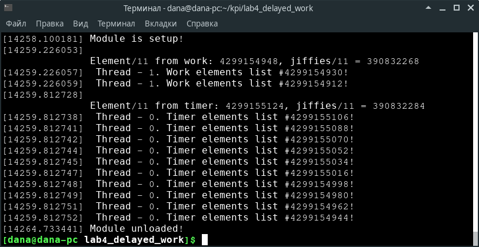

.. Деякі ідеї було запозичено із звіту Олександра Острянка: https://github.com/AlexOstrianko/kpi-embedded-linux-course/tree/master/dk62_ostrianko/lab4_delayed_work

==========================
Звіт з лабораторної роботи
==========================
Лабораторна робота №4: "Таймера та ворки"
_________________________________________

Зміст
_____

	#. `Завдання`_
	#. `Теоретичні відомості`_
		#. `Таймера Linux`_
		#. `Workqueue`_
	#. `Реалізація коду`_
		#. `Реалізація workqueue`_
			#. `struct work_struct or struct delayed_work`_
			#. `schedule_delayed_work()`_
			#. `flush_delayed_work()`_
		#. `Реалізація timer`_
			#. `mod_timer()`_
			#. `del_timer()`_
	#. `Код роботи`_
			#. `Використання флагів`_
			#. `Функції для work та таймера`_
			#. `Функція для потоків`_
			#. `Завчасне вилучення модулю`_
	#. `Результат роботи`_

Завдання
~~~~~~~~

* Вивчити особливості роботи таймерів і workqueue

* Реалізувати два потоки, запустити таймер і ворк в shared workqueue

* При спрацьовуванні таймера перевірити поточне значення jiffies, якщо воно кратно 11 - зупинити потік 1, інакше - таймер повинен перезапустити себе через 17 jiffies

* Усередині ворку перевірити поточне значення jiffies, якщо воно кратно 11 - зупинити потік 2, інакше - ворк повинен заснути на 17 jiffies і перезапустити себе

* Додати два зв'язих списки, в які аллоціювати та додавати елементи зі значеннями jiffies, які не привели до завершення потоків 1 і 2. Виходить зв'язок таймер - список 1 - потік 1. І ворк - список 2 - потік 2

* При виході з потоків роздруковувати списки

* Усередині ворку і таймера використовувати правильні аллокації для нових елементів списку, правильну синхронізацію роботи зі списком

* Передбачити, що користувач може вивантажити модуль до відпрацювання всіх таймерів і ворків

Теоретичні відомості
____________________

В цій лабораторній роботі використовуються списки, виділення пам'яті а також потоки. Для того, щоб пригадати ці моменти можна пройти за посиланням: `потоки, списки <https://github.com/kpi-keoa/kpi-embedded-linux-course/tree/master/dk62_dovzhenko/lab3_kernel_threads>`_.

Таймера Linux 
~~~~~~~~~~~~~

Кінцевими ресурсами для зберігання часу в ядрі є таймери. Таймери використовуються для планування виконання функції (обробник таймера) на певний час в майбутньому. Таким чином, вони працюють не так, як `Workqueue`_ і тасклети, тому що є можливість вказати, коли в майбутньому буде викликатися задана функція, тоді як не можна точно сказати, коли завдання з черги буде виконано. З іншого боку, таймери ядра аналогічні черг завдань в тому, що функція, зареєстрована в таймері ядра, виконується тільки один раз - **таймери не є циклічними**.

Таймери ядра організовані в двухв'язний список. Це означає, що можна створити необмежену кількість таймерів. Таймер характеризується значенням часу очікування (в jiffies) і функцією, яка викликається після закінчення таймера. Оброблювач таймера отримує аргумент, який зберігається в структурі даних, разом з вказівником на сам обробник.

Workqueue
~~~~~~~~~

Workqueue зовні схожі на tasklet; вони дають змогу коду ядра викликати функції в майбутньому. Однак, деякі суттєві відмінності між ними всетаки існують, а саме:

* Тасклети виконуються в контексті програмних переривань, в результаті чого весь код тасклетів повинен бути **атомарним**. Замість цього функції *workqueue* виконуються в контексті спеціального процесу ядра; в результаті вони більш гнучкі. Зокрема, функції workqueue **можуть спати**.

* Тасклети завжди виконуються на процесорі, з якого вони були викликані. Робочі черги працюють так само, за замовчуванням, але цей момент може змінювати програміст.

**Основна відмінність** між ними полягає в тому, що тасклети виконуються *швидко, протягом короткого періоду часу і в атомарному режимі*, в той час як функції робочої черги *можуть мати більш високу затримку, але не повинні бути атомарними*. У кожного механізму є ситуації, коли потрібно використовувати саме їх.

Реалізацію таких черг можна розглянути дещо нижче - `Реалізація workqueue`_.

Реалізація коду
_______________

Реалізація timer
~~~~~~~~~~~~~~~~

Реалізація таймера знаходиться в ``<linux/timer.h>``. Саме в цьому файлі є структура **timer_list**, з допомогою якої і представляють таймера.
Першим кроком для реалізації таймера було оголошення цієї ж структури ``struct timer_list timer``.
Для ініціалізації таймера будемо використовувати наступну функцію:

.. code-block:: c

	timer_setup(&timer, &timer_func, 0);

mod_timer()
~~~~~~~~~~~

Також в коді було використано функцію, яка дозволяє міняти момент часу спрацювання таймера.

.. code-block:: c

	int mod_timer	(struct timer_list * timer,unsigned long expires )	

де, перший параметр це посилання на таймер, який бажаєно змінити,

другий параметр - це встановлення нового часу.

Функція **mod_timer()** дозволяє також працювати з таймером, який був ініціалізованим, але не активний. Якщо таймер не активний, то функція **mod_timer()** *активізує його*. Ця функція повертає *значення 0*, якщо таймер був неактивним, і *значення 1*, якщо таймер був активним. У будь-якому випадку перед поверненням з функції **mod_timer()** таймер буде активізований, і його час спрацювування буде встановлено у вказане значення.

del_timer()
~~~~~~~~~~~

Дану функцію слід використовувати, для того щоб деактивувати таймер до моменту його спрацювання. Така функція працює як з активними, так і неактивними таймерами. Якщо таймер є вже неактивним, то функція повертає *значення 0*, в іншому випадку - *значення 1*. Слід зазначити, що немає потреби використовувати цей таймер, період очікування його вже закінчився, тому що вони вже автоматом деактивуються.

Під час видалення таймера може виникнути ситуація конкуренції. Коли дана функція повертає керування, вона гарантує лише те, що таймер буде не активний,іншими словами його обробник не буде виконуватися в майбутньому. Проте, на багатопроцесорній машині обробник таймера може виконувати в такий момент, на іншому процесорі. 
Для того, щоб деактивувати таймер і почекати, поки завершеться його обробник, який теоретично може виконуватися, необхідно використовувати функціяю **del_timer_sync()**.
Навідмінно від попередньої функції, **del_timer_sync()** не може бути викликана в контексті переривання.
Якщо порівнювати ці дві функцію, то набагато краще використовувати **del_timer_sync()**, ніж **del_timer()**. Тому не можна гарантувати, що обробник таймера в даний момент ніде не виконуються.

Реалізація workqueue
~~~~~~~~~~~~~~~~~~~~

Для того, щоб працювати з робочою чергою слід підключити ``#include <linux/workqueue.h>``.

struct work_struct or struct delayed_work
~~~~~~~~~~~~~~~~~~~~~~~~~~~~~~~~~~~~~~~~~

* ``struct work_struct`` - планує виконати завдання
* ``struct delaned_work`` - планує виконання завдання після заданого інтервалу часу

**struct delaned_work** використовує таймер для запуску після зазначеного інтервалу часу. Виклики з цим типом схожі на виклики для **struct work_struct**, але мають *_delayed* в назвах функцій.
Друга структура, а саме **struct delaned_work** з'явилася завдяки Девіду Хауеллсу, який розглядуючи робочі черги, зауважив, що структура **work_struct**, яка описує завдання, яке має бути виконано, досить велика. На 64-бітних машинах це може бути близько 96 байт. Це досить важко для конструкцій, які можна використовувати в досить великих кількостях. Тому він вирішив знайти способи зробити його менше. Він досяг успіху, але за рахунок деяких змін в API черзі завдань. 

Перед використанням структури необхідно її ініціалізувати. Для цього будем використовувати такі макроси:

.. code-block:: c

	DECLARE_WORK(name , void (*function)(struct work_struct *));
	DECLARE_DELAYED_WORK(name, void(*function)(struct work_struct *));	
	INIT_WORK(struct work_struct *work, void(*function)(struct work_struct *));
	INIT_DELAYED_WORK(struct delayed_work *work, void(*function)(struct work_struct *));

За допомогою **DECLARE_WORK()** та **DECLARE_DELAYED_WORK()** оголошують та ініціалізують елемент структури, а завядки **INIT_WORK()** та **INIT_DELAYED_WORK()** ініціалізують вже задеклорований елемент *work*.

schedule_delayed_work()
~~~~~~~~~~~~~~~~~~~~~~~

Після того, як виконали оголо<шення за ініціалізацію можна запланувати задачу, за допомогою:

.. code-block:: c

	schedule_work(struct work_struct *work);
	 or
	schedule_delayed_work(struct delayed_work *work, unsigned long delay);

В аргументи **schedule_delayed_work** задається сама структура, а також довжина затримки. Одиниця виміру часу затримки - **jiffies**.
Повертає нуль, якщо *work* вже був у глобальній робочії черзі ядра, і ненульовий в іншому випадку відповідно.

flush_delayed_work()
~~~~~~~~~~~~~~~~~~~

Ця функція забезпечує, те що ми чекаємо, поки робоча черга закінчить виконання всіх своїх елементів.

.. code-block:: c

	bool flush_delayed_work (struct delayed_work * dwork);

Код роботи
___________

Використання флагів
~~~~~~~~~~~~~~~~~~~

Оскільки таймер працює в режимі переривання, то скористатися **kthread_stop()** неможливо. Тому для того, щоб зупинити поток у функції таймера, коли цього вимагає умова задачі, було використано структуру флагів:

.. code-block:: c

	struct flags_str {
		bool thr_run[NUMBER_OF_KTHREADS];
		bool timer_run;
		bool work_run;
	};
 
Перший флаг відповідає за роботу потоків, а два наступних за роботу таймера і черги відповідно. Перший флаг допомогає вийти  з нескінченного циклу, у той час як наступні два використовуються для зручності подальшого вилучення модулю.

Функції для work та таймера
~~~~~~~~~~~~~~~~~~~~~~~~~~
Дані функції схожі за своєї логікою роботи. Візьмемо за приклад функцію **work**:

.. code-block:: c

	void work_func(struct work_struct *data)
	{
		long int jif_work = jiffies;
		struct struct_result_of_kth *work_data;
		if ((jif_work % 11) == 0) {
			printk(KERN_INFO "\nElement/11 from work: %li, jiffies/11 = %li\n", jif_work, jif_work/11);
		flags.thr_run[1] = false;
		} else {
			work_data = kmalloc(sizeof(*work_data), GFP_KERNEL);
			if (work_data){
				work_data->cnt = jif_work;
				list_add(&work_data->list, &second_list.list);
			} else {
				printk(KERN_ERR "kmalloc didn`t allocate memory!\n");
				thr_run[1] = false;
			if (flags.work_run) {
				schedule_delayed_work(&work, 17);
			}
		}
	}

Завдяки цій функції буде виконуватися пошук **jiffies**, який кратний числу 11. За умовою лабораторної роботи, якщо відповідне число знайдеться, то потрібно зупинти відповідний поток, та вивести це значення в лог ядра. У функції видно, що якщо число знайдено, тоді флаг, який відповідає за роботу першого потоку перейде у стан *false*. Якщо таке число не було знайдено, тоді функція додає наступний елемент у список, який відповідає за значення, що утворюються в другому потоці. Після цього за допомогою розглянутою вже функціїї `schedule_delayed_work()`_ виставляємо перезапуск ворка через **17 jiffies**.

Функція для потоків
~~~~~~~~~~~~~~~~~~~

.. code-block:: c

	int th_func(void *data)
	{	
		if ((int *)data == 0) goto TIMER_KTH;
		if ((int *)data == 1) goto WORK_KTH;
		TIMER_KTH:
			while (flags.thr_run[0]) {
				schedule();
			}
			struct struct_result_of_kth *temp_t = NULL;
			list_for_each_entry(temp_t, &(first_list.list), list) {
			printk(KERN_NOTICE "\tThread - %i. Timer elements list #%li!\n", 
				(int *)data, temp_t->cnt);
			}
			do_exit(1);
		WORK_KTH:
			while (flags.thr_run[1]) {
				schedule();
			}
			struct struct_result_of_kth *temp_w = NULL;
			list_for_each_entry(temp_w, &(second_list.list), list) {
				printk(KERN_NOTICE "\tThread - %i. Work elements list #%li!\n", 
					(int *)data, temp_w->cnt);
			}
			do_exit(1);	
	}

Першим кроком буде те що, за допомогою флагу, який відповідає за роботу потоків **thr_run** відбувається робота нескінченого циклу **while**, за допомогою якого відбувається передача прав на виконання для інших процесів. Це використовується для того, щоб затримати наступне викоання функції для потоку, поки не настав потрібний час.

Для подальних дій потрібно, щоб програма розуміла з яким саме потоком вона працює, оскільки їх є два, як вже вказано в умові: один відповідає за таймер, інший за ворк. Тому коли відбувається запуск потоків, передається і його номер:

.. code-block:: c

	for (int i = 0; i < NUMBER_OF_KTHREADS; i ++) {
		kthreads_ptr[i] = kthread_run(&th_func, (void *)i, "thread_%i", i);
		flags.thr_run[i] = true;
	}

Відповідно, знаючи номер ми переходимо до частини функції яка відповідає за обраний процес. 
Ці частини схожі, і вони виконують вивід списку значень, які не є краткі 11.

Завчасне вилучення модулю
~~~~~~~~~~~~~~~~~~~~~~~~~

Може виникнути ситуація, коли користувач вигружає модуль до того, як таймер та ворк знайшли значення **jiffies**, яке кратне 11. 
В даному випадку необхідно вручну виставити відповідні флажки завершення потоків, таймеру та ворку, та дочекатися іх завершення.

.. code-block:: c

	for ( int i = 0; i < NUMBER_OF_KTHREADS; i++) {
		if (flags.thr_run[i]) {
			flags.thr_run[i] = false;
			kthread_stop(kthreads_ptr[i]);
		}
	}

	if (flags.work_run) {
		flags.work_run = false;
		while (flush_delayed_work(&work));
	}
	
	if (flags.timer_run) {
		flags.timer_run = false;
		del_timer_sync(&timer);
	}

Виставляємо флаг для потоку у стан **false** для того, щоб потоки могли закінчитися.

Результат роботи
________________

На рисунку нижче продемонстровано результат роботи. 
Видно, що знайдено число для таймера і для ворка, яке кратне 11, а також виведено список значень, які не підійшли під заданому умову.

