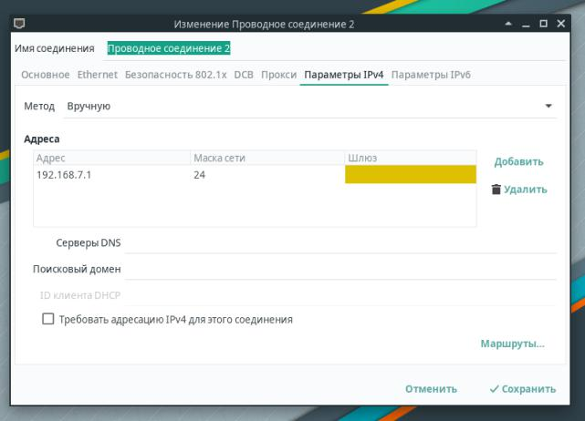

============================
ЛР1: Перший embedded додаток
============================

Зміст роботи
------------

#. Технічне завдання

#. Початок роботи та налаштування BeagleBoardXM

#. Программа з використанням pthread

#. Результат роботи

#. Висновок

1. **Технічне завдання**
------------------------

.. code-block::
     
     	Нужно написать на С программу, которая
    		- запускает два потока (используя pthread);
		- каждый поток увеличивает значение глобальной переменной на 1 в цикле 100000000 раз
		- в конце делает join потоков и выводит полученное значение переменной
		- собрать с флагами -O0 и -O2 для x86 и для платы
		- сравнить и объяснить полученные результаты

2. **Початок роботи та налаштування BeagleBoardXM**
---------------------------------------------------

Розпочати роботу з даним одноплатним ком'ютером досить просто, особливо розбивши її на прості дії:

* Знайомство з ReferenceManualBBXM
* Завантаження образу операційної системи Debian Stretch for BeagleBoard з офіційного сайту `з офіційного сайту <https://beagleboard.org/latest-images>`_
* Розпакувати завантажений образ на microSD картку за допомогою команди

.. code-block::
     
     sudo sh -c "xz --decompress --keep --stdout bbxm-debian.img.xz | dd status=progress bs=4M of=/dev/mmcblk1; sync"

і, вставивши картку в потрібний порт, під'єднати через miniUSB плату до основної машини.

Ми маємо пересвідчитись, що плата коректно визначилась системою та працює, а для цього достатньо виконати просту команду

.. code-block::
     
     lsusb

а, у відповідь, побачити такий текст 

.. code-block::
     
     ID 1d6b:0104 Linux Foundation Multifunction Composite Gadget

Оскільки дана робота виконувалась з віртуальною машиною, в якості основної, довелось власноруч налаштувати IP адресу:

і обов'язково перевірити зв'язок з платою за допомогою команди

.. code-block::
     
     ping 192.168.7.2

Після наведених вище налаштувань можна підключитись до BBXM по ssh, ввівши команду

.. code-block::
     
     ssh debian@192.168.7.2

та використовуючи стандартні логін  – ``debian`` та пароль - ``temppwd`` ввійти в систему.

3. **Программа з використанням pthread**
----------------------------------------

За кілька годин було написано код (наведено в директорії **src**), що використовує 2 потоки, а потім, в кінці, об'єднує їх. 
Для компіляції було створено Makefile (наведено в кореневій директорії), що містить в собі всі необхідні флаги. А особливо: пункт оптимізації коду, вплив якого буде проілюстровано в наступному розділі нижче.

4. **Результат роботи**
-----------------------

Як результат роботи буде наведено кілька знімків екрану, що ілюструють роботу даного коду із різними режимами оптимізації на різних машинах: BBXM та віртуальній машині, що має 2 ядра, 2 гб оперативної пам'яті, 1 гб відеопам'яті та працює під керуванням операційної системи Manjaro

	.. image:: .etc/img/pc_o0.jpg
Робота программи на віртуальній машині та оптимізації -o0 наведена вище

	.. image:: .etc/img/bbmx_o0.jpg
Робота программи на BeagleBoardXM та оптимізації -o0 наведена вище 

	.. image:: .etc/img/pc_o2.jpg
Робота программи на віртуальній машині та оптимізації -o2 наведена вище

	.. image:: .etc/img/bbmx_o2.jpg
Робота программи на BeagleBoardXM та оптимізації -o0 наведена вище 

5. **Висновок**
---------------

Ця лабораторна робота є відправною точкою у вивченні сфери **embedded linux** та дає змогу не тільки спробувати багатопоточність, а й відчути її роботу на одноплатному мікрокомп'ютері BeagleBoneXM. Результат даної роботи повністю відповідає заданому технічному завданню і має схожі з експериментально-отриманими результатами з інших джерел.
