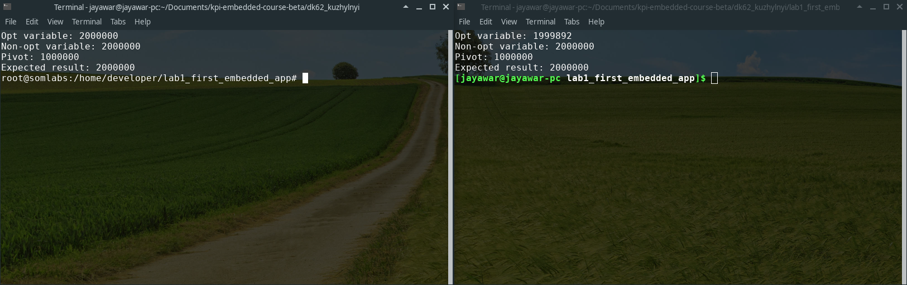
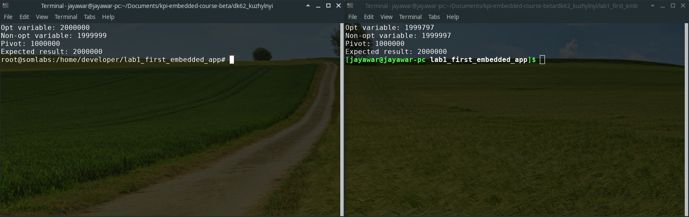

# Лабораторна робота №1

### Мета: Розробити та дослідити багатопоточну програму у середовищі User space середовищі Linux

Для виконання лабораторної роботи було використанно Posix threads інтерфейс для запиту двух потоків, що інкрементують одну змінну від 0 до 'Pivot' значення.З дослідницькою метою було використано типи **int** та **volatile int**  для передачі у потоки. Це необхідно для того щоб перевірити як буде відрізнятися результат розрахунку змінної, яку компілятор оптимізуює та навпаки, тої, якої значення може змінюватися ззовні і  компілятор не буде оптимізувати цю змінну.Дані змінні та 'Pivot' константа передаються потоку зібраними у структуру.

Розрахунки проводилися на Архітектурах
 **x86_64** та **armv7l**
 
Для зменшення похибки пов'язанної з розрядністю архітектур було використанно змінні 32 розрядні змінні типу **uint32_t**. Розрахунки було проведено при оптимізації gcc **O2** та **O1**

Результати розрахунків. **armv7l | x86_64**

**gcc з оптимізацією O0**

**gcc з оптимізацією O0**

Результати показують, що для x86_64 виникає деяка похибка при розрахунку першої змінної.Для забезпечення гарантії правильності виконання необхідно використати додаткові примітиви синхронізації.У даному випадку оптимізація gcc не вносить дуже вагомих внесків у зменшенні похибки при розрахунку. 

