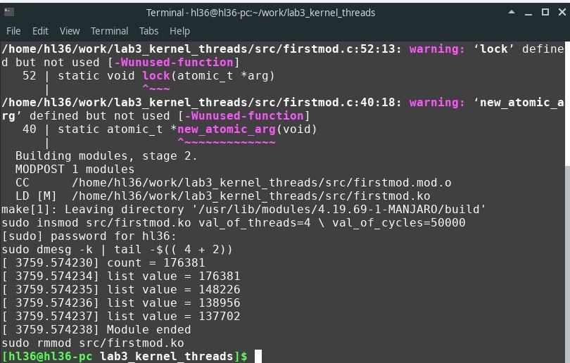
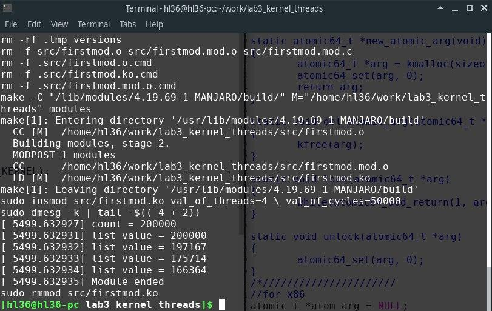

=====================
Лабораторна робота №3
=====================

**Завдання:**

* Изучить принципы работы со списками в ядре, потоки и механизмы синхронизации

* Написать модуль ядра, который:

  - содержит переменную
  - запускает M потоков на одновременное выполнение
  - каждый поток инкрементирует переменную N раз, кладет значение переменной в список и завершается
  - при выгрузке модуль выводит значение переменной и содержимое списка использовать параметры модуля для задания инкремента N и количества потоков M (в коде параметры должны называться осмысленно)
  - для переменной, списка, потоков использовать динамическую аллокацию. Переменную передавать в поток по ссылке аргументом

* Проверить на x86 и BBXM. Продемонстрировать, что без синхронизации итоговое значение глобальной переменной неправильное

* Реализовать функции lock() и unlock() с использованием атомарных операций ядра (atomic.h, отличается в зависимости от архитектуры). Предусмотреть возможность работы как на x86, так и на BBXM (например, можно использовать макроопределения ядра для условной компиляции). Продемонстрировать работоспособность.

* Защитить доступ к шареным элементам (список тоже к ним относится). Продемонстрировать правильность работы на x86 и BBXM

* Необходимо учитывать и корректно отрабатывать возможные ошибки. Например, kmalloc может не выделить память. При ошибке ресурсы должны деаллоцироваться в порядке обратном аллокации (можно использовать goto или битовое поле с флагами), а в лог ядра выводится ошибка (KERN_ERR или другой подобный уровень лога, но не KERN_INFO)

* Все промежуточные результаты описать и включить в отчет

--------------------

**Хід роботи:**

* Для початку додамо дві змінні, які будуть вказувати на кількість потоків і на кількість інкрементацій. Для цього в ``Makefile`` додаємо дві змінні:

.. code-block::

  threads = 4
  cycles = 50000

* Та в модулі ядра додаємо:

.. code-block::

  static int val_of_threads;
  module_param(val_of_threads, int, 0);
  MODULE_PARM_DESC(num_t, "number threads");

  static int val_of_cycles;  
  module_param(val_of_cycles, int, 0);
  MODULE_PARM_DESC(num_c, "number cycles");

* Створивши глобальну змінну:

.. code-block::

  int *count = NULL;

створюємо струкуру, яка буде мати список (використовуючи бібліотеку ``list.h`` ) та зберігати значення злобальної змінної ``cnt``:

.. code-block::

  struct save_list {
	struct list_head list;
	int value;
  };
  struct save_list *list_pointer = NULL;
  struct save_list head_list;

та ініціалізуємо цей список:

.. code-block::

  INIT_LIST_HEAD (&head_list.list);

* Далі створимо певну кількість потоків. Для цього використовуючи бібліотеку ``kthread.h`` створимо змінну потоку:

.. code-block::

  struct task_struct **t = NULL;

та інінціалізуємо кожен з потоків:

.. code-block::

	for (int i = 0; i < val_of_threads; i++){
		t[i] = kthread_run(&thread_func, (void *)count, "_thread[%i]_", i);
	}
, де thread_func - назва функції, яка буде виконуватись при створенні потоку, (void *)cnt - змінна, яку ми передаємо.

* Після цього необхідно виділити пам'ять для глобальної змінної:

.. code-block::

	count = kmalloc(sizeof(*count), GFP_KERNEL);
	if(count == NULL) {
		goto Count_Error;
	}

і якщо пам'ять не виділеться, тоді переходимо на ``Cnt_Error``, де буде виконуватись наступне:

.. code-block::

	Count_Error:
		printk(KERN_ERR "count hasn't memory\n");
		kfree(count);
		count = NULL;

тобто, буде оголошено, що пам'ять не виділеться та очистимо пам'ять для цієї змінної. 

* Аналогічно буде виконано і для виділення пам'яті під кожен потік:

.. code-block::

	t = kmalloc(sizeof(*t) * val_of_threads, GFP_KERNEL);
	if(t == NULL) {
		goto Thread_Error;
	}

* Як було сказано вище, кожен потік виконує функцію, яка виконує ітерацію глобальної змінної та після чого за допомогою ``shedule()`` змінюємо потік:

.. code-block::

int *func_value = data;
	for (int i = 0; i < val_of_cycles; i++){
		*func_value += 1;
		schedule();
	}

* Після цього, виділяємо пам'ять під структуру для зберігання результату кожного потоку та оголошуємо помилку при невиділенні пам'яті:

.. code-block::

	list_pointer =  kmalloc(sizeof (*list_pointer), GFP_KERNEL);
	if(list_pointer == NULL) {
		goto Struct_Error;
	}
	list_pointer->value = *func_value;

та додаємо результат в список:

.. code-block::

	  list_add(&list_pointer->list, &head_list.list);

* Далі перед виходом необхідно роздрукувати результати ітерації потоків, видалити список та очистити виділену пам'ять:

.. code-block::

	  list_for_each_safe(iter, iter_safe, &(head_list.list)) {
		list_pointer = list_entry(iter, struct save_list, list);
		printk (KERN_NOTICE "list value = %d", list_pointer->value);
		list_del(iter);
		kfree(list_pointer);
	}
	
	del_atomic_arg(atom_arg);
	kfree(count);
	kfree(t);
* Результатом такої роботи зображено нижче для платформи ``х86`` :

* Далі для створення синхронізації було створено функції lock()/unlock(). Для їх використання необхідно використовувати атомарні операції, тому було використано бібліотеку ``atomic.h`` . Для було створено атомарну змінну, яка має тип ``atomic_t`` :

.. code-block::

  atomic64_t *atom_arg = NULL;

* Далі, для подальшої роботи, дану змінну необхідно ініціалізувати за допомогою функції ``new_atomic_arg`` :

.. code-block::

  static atomic64_t *new_atomic_arg(void)
  {
  	atomic64_t *arg = kmalloc(sizeof(*arg), GFP_KERNEL);
  	atomic64_set(arg, 0);
  	return arg;
  }

* Далі було створено функцію lock(), яка повинна блокувати доступ до певної частини коду, поки не буде оголошена функція unlock(), яка розблокує доступ. Функція ``lock()`` використовує атомарну операцію ``atomic64_add_return`` , яка сумує два значення. Принцип роботи функції такий: створюється нескінченний цикл, який буде виконуватись доти, поки не виконається сума аргумента arg та 1, і результатом суми буде одиниця:

.. code-block::

  static void lock(atomic64_t *arg)
  {
	while(atomic64_add_return(1, arg) != 1);
  }

* Результатом роботи використовуючи таку ітерацію:

.. code-block::

	for (int i = 0; i < val_of_cycles; i++){
		lock(atom_arg);
		*func_value += 1;
		unlock(atom_arg);
		schedule();
	}

зображено нижче:

--------------------

**Висновок:**

Отже, з результатів можна сказати, що для ``x86`` не використовуючи функції ``lock()/unlock()`` результат ітерацій буде невірним (як і в першій лабораторній роботі), а з використанням даних функцій - вірний. Це пов'язано з тим, що потоки можуть переривати один одного, в результаті будуть відбуватися втрати ітерацій.

