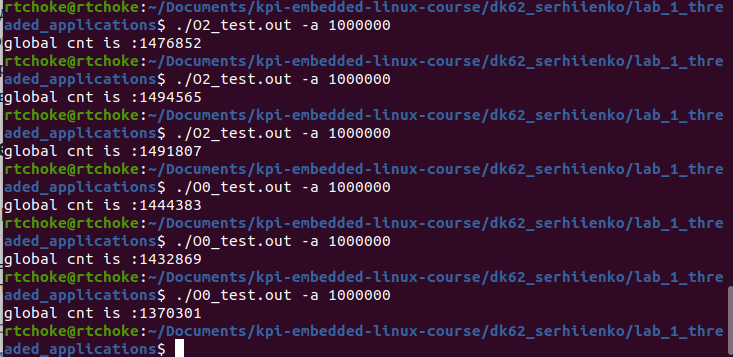
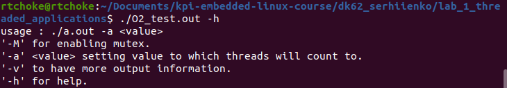
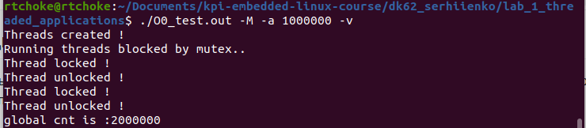
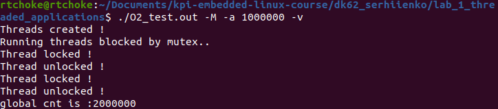
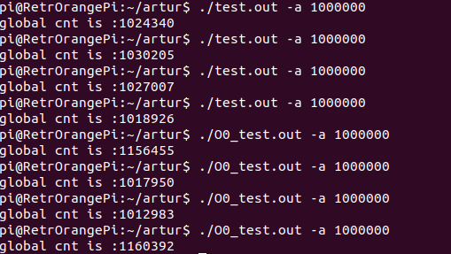
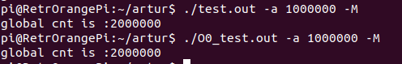

Лабораторна робота №1. Тестування мультипоточності на платі OrangePi PC та на х86 архітектурі.
-------------------------------------------------------------------------------------------------
Завдання.
--------
.. code-block::
Нужно написать на С программу, которая:
 * запускает два потока (используя pthread);
 * каждый поток увеличивает значение глобальной переменной на 1 в цикле 100000000 раз
 * в конце делает join потоков и выводит полученное значение переменной
 * собрать с флагами -O0 и -O2 для x86 и для платы
 * сравнить и объяснить полученные результаты

Створення програми, принцип її роботи, та збірка за допомогою ``make``
---------------------------------------------------------------------
Принцип роботи:
--------------

Створюється два потоки, які інкрементують глобальну змінну, по завершенню інкрементації, потоки повертаються у головний потік (main), виводиться значення глобальної змінної.
Аргументи командного рядку
 * Програма потребує обов'язкові аргументи, а саме : ``-a`` <кількість інкрементацій>.
 * Є можливість ввести додаткові аргументи: ``-M`` (запуск програми з використанням mutex), ``-v`` (розширений вивід інформації)
   ``-h`` (допомога).
 * В залежності від введених аргументів, програма поводиться по різному.

Makefile:
---------
.. code-block::

Компіляція та збірка програми відбувається через ``Makefile`` .
Команди ``Makefile``
 * ``build`` - збірка під х86 з флагами оптимізації ``-O2`` та ``-O0``.
 * ``clean`` - очищення директорії від .out файлів та об'єктних файлів .o.
 * ``all``- викликається ``clean`` а потім ``build``.
 * ``build-arm`` - збірка під arm-архітектуру з флагами оптимізації ``-O2`` та ``-O0``.

Демонстрація роботи на х86 архітектурі, та на платі OrangePi PC(ARM).
-------------------------------------------------------------------
x86-архітектура.
---------------
Запуск програми скомпільованої з флагом ``O0`` та ``O2``

Запуск програми з аргументом ``-h``

Запуск програми з аргументом ``-М`` (використання mutex) та ``-v``(розширений вивід). Флаг ``-O0``

Запуск програми з аргументом ``-М`` (використання mutex) та ``-v``(розширений вивід). Флаг ``-O2``

OrangePi PC 
------------
У курсі embedded linux, ми використовуємо плати BeagleBone, але через обмеженість у використанні даної плати, унеможливлюється тестування програмного забезпечення у будь-який зручний, для студента, час.
Тому програмне забезпечення було протестоване на платі OrangePi, яка має ARM-архітектуру, та встановлену debian-подібну ОС. Використання іншої плати суттєво `не впливає` на кінцевий результат.

Запуск програми скомпільованої з флагом ``-O0`` та ``-O2``

Запуск програми з аргументом ``-М`` (використання mutex).  Флаг ``-O0`` та флаг ``-O2``.

Висновки
------------------------------

З наведених вище зображень, видно, що програмне забезпечення поводить себе досить дивно, якщо не запускати його з аргументом ``-M``. Згідно з мети лабораторної роботи, ми повинні отримати число в два рази більше(тому що два потоки інкрементують глобальну змінну, а не один) , аніж те, що ми передали як аргумент. Різні флаги оптимізації суттєво не впливають на кінцевий результат. 

Проблема у тому, що планувальник задач, перериває роботу потоку, ще до того, як потік виконав усі свої інструкції, та передає контроль іншому потоку. Припустимо, що перший потік, встиг інкрементувати глобальну змінну до *5000*, та зберіг це число в свою локальну змінну. Далі другий потік починає роботу, інкрементує глобальну змінну до *10000*, та переривається планувальником задач. Управління передається першому потоку, але він починає інкрементувати не з *10000*, а з *5000*. Тому ми можемо бачити такі значення в кінцевому результаті. Відбувається нібито `гонка <https://practice.geeksforgeeks.org/problems/what-is-race-condition>`__ між двома потоками. Якщо запускати декілька разів програму, то видно, що результат майже завжди різний. Це через непередбачувану роботу планувальника задач.

Запускаючи програму з аргументом ``-M`` ми можемо побачити, що програма спрацьовує, так як ми запланували. Діло в тому, що ключ ``-M`` ініціалізує mutex (примітив синхронізації), та передає його у функцію яку використовує потік. Mutex не дозволяє використовувати одну і ту саму ділянку коду, двум, або більше потокам. Тобто, при запуску потоків, один з них блокується mutex'ом, та інкрементує змінну до заданого в аргументах значення, інший потік, не може втрутитись, та почати свої справи, якщо ця ділянка коду, використовується. Після завершення роботи першим потоком, mutex розблоковує його, тепер інші потоки зможуть використовувати цю ділянку коду.
   

