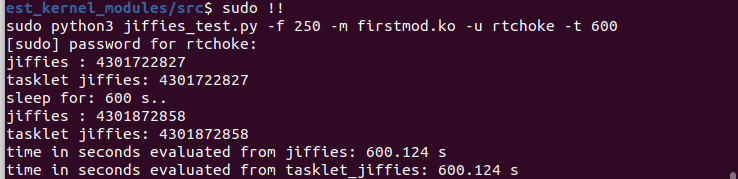

Лабораторна робота №2.Простий модуль ядра.
-----------------------------------------
Завдання.
---------

.. code-block::
* Перенести на плату и установить заголовки ядра
* Собрать модуль ядра из примера выше на x86 и BBXM. После каждого подключения и отключения модля к ядру смотреть логи ядра (лучше всего, с использованием dmesg)
* Взять секундомер. Засечь время между двумя включениями модуля на x86 и BBXM. Взять соответствующие значения jiffies из логов. Зависит ли разница в двух значениях jiffies от платформы? Почему? Обоснование включить в протокол.
* Экспериментально рассчитать время (в миллисекундах), равное 1 jiffies. Сравнить с теоретическим значением. Результаты включить в протокол по работе.
* Подправить модуль из примера, что бы вместо username, выводилось имя, переданное в качестве параметра модуля при его подключении insmod
* Добавить в init полученного модуля ядра тасклет, который также выведет текущее значение jiffies

Хід роботи.
-----------

Було модифіковано код, який стягнуто з папки ``demo``. Додана можливість передачі аргумента в модуль ядра, а саме ``нікнейм користувача`` (username)
Також, було створено tasklet, який за своїм принципом роботи, схожий на потік. Отриманий Tasklet дуже простий, він всього лиш виводить значення jiffies у лог ядра.
Усі розрахунки, було покладено на написаний на мові ``Python`` скрипт, який приймає аргументи з командного рядку, запускає та вимикає модуль ядра, чекає деякий час, та знову
проводить операцію наведену раніше. Також ций скрипт витягує потрібну інформацію з логів ядра, а точніше - поточне значення ``jiffies`` .
Далі проводяться розрахунки, та одразу виводиться результат.

**Розбір ``Python-script``**

Вихідний код можна переглянути `тут <https://github.com/RTshok/kpi-embedded-linux-course/blob/develop/dk62_serhiienko/lab2_simplest_kernel_modules/src/jiffies_test.py>`__

Вхідні аргументи

* ``-t`` - Час очікування між виконанням роботи двох модулів.
* ``-m`` - Модуль ядра, наприклад: ``test.ko``
* ``-u`` - Нікнейм юзера
* ``-f`` - Частота переривань системного таймеру (можна отримати на ``Ubuntu`` таким чином : ``grep 'CONFIG_HZ=' /boot/config-$(uname -r)`` ) на моїй системі - ``CONFIG_HZ = 250``
 
Приклад запуску скрипта: ``sudo python3 jiffies_test.py -f 250 -m firstmod.ko -u rtchoke -t 600``

Результати роботи на х86.
------------------------

Результат роботи ``Python`` скрипта, який підключає\відключає модуль ядра, та проводить розрахунки.

Як можемо побачити, результати виведення з тасклету, та звичайного виведення значення ``jiffies`` не відрізняються. 
Але, видно, що є деяка похибка. При різниці в увімкненні модулів в 10 хвилин, похибка 124 мс(похибка порядку 0,02%). Для програм які не потребують чітких часових рамок, це не створить проблем.
Але, якщо потрібна точність до мікро/наносекунд, на мою думку ``jiffies`` не підійде, та й лінукс також (але це вже зовсім інша історія).

Результати роботи на BBXM
-------------------------
..To be continued..

Висновки
--------

Як можемо побачити, на х86 архітектурі ``jiffies`` показує себе, як доволі точний механізм відліку часу (для нечуттєвих до часу задач).
Похибку можна зменшити, піднявши частоту переривань системного таймеру ближче до 1000 HZ, але потрібно враховувати, що суттєвий процесорний час буде забиратись на обробку переривань.
Що призведе до погіршення швидкодії.

