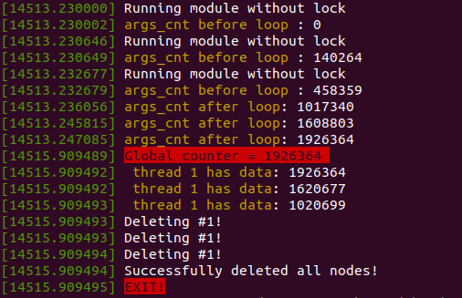
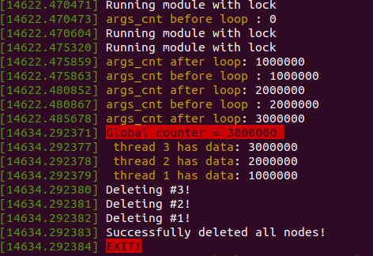

Лабораторна робота №3. Потоки, списки, та їх синхронізація у ядрі Linux.
-----------------------------------------------------------
Задание на третью лабораторную:

- Изучить принципы работы со списками в ядре, потоки и механизмы синхронизации

Написать модуль ядра, который:
  - содержит переменную
  - запускает M потоков на одновременное выполнение
  - каждый поток инкрементирует переменную N раз, кладет значение переменной в список и завершается
  - при выгрузке модуль выводит значение переменной и содержимое списка
  - использовать параметры модуля для задания инкремента N и количества потоков M (в коде параметры должны называться осмысленно)
  - для переменной, списка, потоков использовать динамическую аллокацию. Переменную передавать в поток по ссылке аргументом

- Проверить на x86 и BBXM. Продемонстрировать, что без синхронизации итоговое значение глобальной переменной неправильное
- Реализовать функции lock() и unlock() с использованием атомарных операций ядра (asm/atomic.h, отличается в зависимости от архитектуры). Предусмотреть возможность работы как на x86, так и на BBXM (например, можно использовать макроопределения ядра для условной компиляции). Продемонстрировать работоспособность.

Теоретичний матеріал
--------------------
*Потоки у просторі ядра.*

Вони мають деяку відмінність від потоків у юзерспейсі, а саме те що потоки в просторі ядра ``kthread`` не мають адресного простору ``mm = NULL`` . 
Ці потоки працюють тільки в просторі ядра, і їх контекст не переходить в простір користувача. Проте потоки в просторі ядра плануються і витісняються так само, як і звичайні процеси.

взято `звідси <https://wm-help.net/lib/b/book/1662500978/47>`__

*Зв'язні списки*

Ядро лінукса передбачає API, яке має у собі зв'язні списки, але такі списки не прості (**есть один нюанс**). Ця структура імплементована як opaque-type, 
тобто реалізація списків не дозволяє використовувати поля структури напряму, тому що вони недоступні(приховані) для юзера.
Якби дивно це не звучало, але в процесі користування ми маємо вказівник на список списків..

*Примітиви синхронізації*

Можна виділити декілька примітивів синхронізації, а саме ``mutex`` , ``semaphore`` та більш низькорівневий примітив ``spinlock``. В процесі лаб роботи, було визначено схожість ``spinlock`` та ``lock()`` який було реалізовано використовуючи атомарну змінну ``atomic_t``.
Тому є сенс описати ций примітив синхронізації детальніше. Логіка роботи доволі проста, тий процес який першим захопив ``spinlock`` має можливість доступатись до загального участку пам'яті, та не може бути перерваним іншими потоками.
Після виконання усіх запланованих дій, процес повинен відпустити ``spinlock``. Далі, тий процес який знову перший захопить ``spinlock`` тий виконує свої операції, всі інші - крутяться (``spin``) в циклі, чекаючи на дозвіл захоплення ``spinlock'а``.

Хід роботи
----------
Було написано модуль ядра, який приймає декілька параметрів як аргументи, а саме : ``кількість потоків`` , та ``кількість інкрементів глобальної змінної у потоці``.
Модифіковано ``Makefile``. Тепер є можливість встановити на процесі компіляції присутність/відсутність примітиву синхронізації в програмі.
Для цього потрібно при компіляції за допомогою ``make`` передати деяку команду : `` make CFLAGS+= KCPPFLAGS+= -DLOCK `` .

Результат роботи без примітиву синхронізації х86:

Результат роботи з примітивом синхронізації х86:

Висновки
--------
Як можна побачити з рисунків, потоки безцеремонно намагаються урвати ласий шмат пам'яті, але через те, що вони постійно переривають друг друга, нічого не виходить(див. лаб1).
Але як тільки з'являється наглядач(``spinlock``), все стає на свої місця, ми отримуємо результат, який і очікували.
