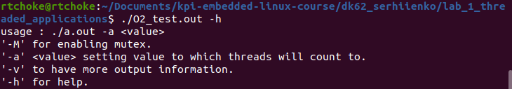

Лабораторна робота №1. Тестування мультипоточності на платі BeagleBone(ARM) та на х86 архітектурі.
-------------------------------------------------------------------------------------------------
Завдання.
--------
.. code-block::
Нужно написать на С программу, которая:
 * запускает два потока (используя pthread);
 * каждый поток увеличивает значение глобальной переменной на 1 в цикле 100000000 раз
 * в конце делает join потоков и выводит полученное значение переменной
 * собрать с флагами -O0 и -O2 для x86 и для платы
 * сравнить и объяснить полученные результаты

Створення програми, принцип її роботи, та збірка за допомогою ``make``
---------------------------------------------------------------------
Принцип роботи:
--------------
Створюється два потоки, які інкрементують глобальну змінну, по завершенню інкрементації, потоки повертаються у головний потік (main), виводиться значення глобальної змінної.
Аргументи командного рядку
 * Програма потребує обов'язкові аргументи, а саме : ``-a`` <кількість інкрементацій>.
 * Є можливість ввести додаткові аргументи: ``-M`` (запуск програми з використанням mutex), ``-v`` (розширений вивід інформації)
   ``-h`` (допомога).
 * В залежності від введених аргументів, програма поводиться по різному.

Makefile:
---------
.. code-block::
Компіляція та збірка програми відбувається через ``Makefile`` .
Команди ``Makefile``
 * ``build`` - збірка під х86 з флагами оптимізації ``-O2`` та ``-O0``.
 * ``clean`` - очищення директорії від .out файлів та об'єктних файлів .o.
 * ``all``- викликається ``clean`` а потім ``build``.
 * ``build-arm`` - збірка під arm-архітектуру з флагами оптимізації ``-O2`` та ``-O0``.

Демонстрація роботи на х86 архітектурі, та на платі BeagleBone(ARM).
-------------------------------------------------------------------
x86-архітектура.
---------------
Запуск програми скомпільованої з флагом ``O0`` та ``O2``

.. image:: img/O0,O2_without_mutex.png

Запуск програми з аргументом ``-h``

Запуск програми з аргументом ``-М`` (використання mutex) та ``-v``(розширений вивід). Флаг ``-O0``

.. image:: img/mutex_verbose_O0.png

Запуск програми з аргументом ``-М`` (використання mutex) та ``-v``(розширений вивід). Флаг ``-O2``

.. image:: img/mutex_verbose_O2.png

BeagleBone(ARM) 
--------------
...

