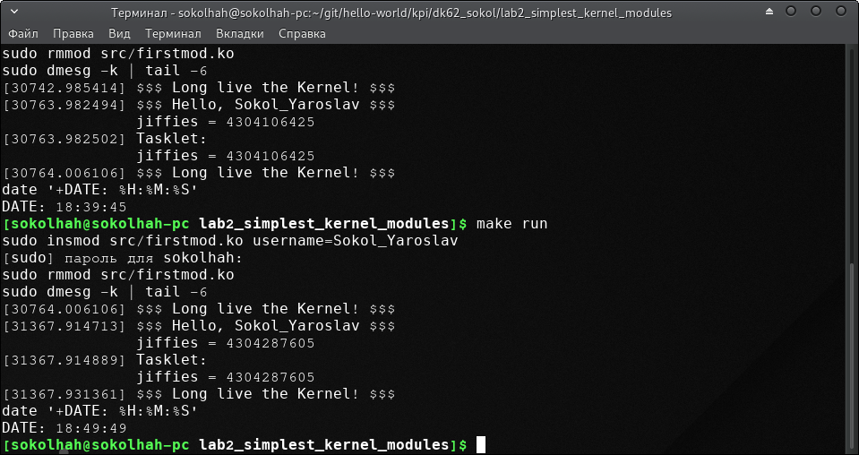
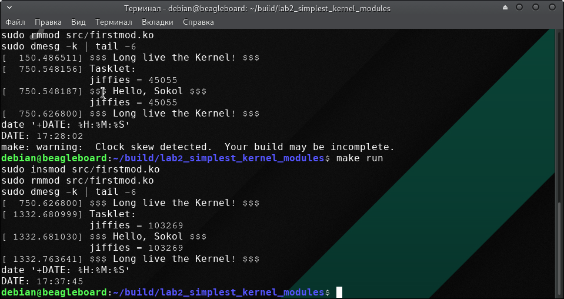

=====================
Лабораторна робота №2
=====================
**Завдання:**

* подправить модуль из примера, что бы вместо ``username``, выводилось имя, переданное в качестве параметра модуля при его подключении ``insmod``

* изучить материалы INOB

* добавить в ``init`` полученного модуля ядра тасклет, который также выведет текущее значение ``jiffies``

* объяснить, почему разница между двумя выводимыми ``jiffies`` (в init и в тасклете) может быть равна 0, 1 или 2

---------------------

**Коротко про ``tasklet``:**

* Його можна назвати маленьким потоком, у якого немає ні свого стека, ні контекста. Такі "потоки" оброблюються швидко та повністю. Також вони є атомарними. Їм можна задавати пріоритети. Якщо їх декілька, тоді вони можуть виконуватись паралельно.

* Перед їх використовуванням, необхідно спочатку їх ініціалізувати таким чином:
.. code-block::

  DECLARE_TASKLET(name_tasklet, tasklet_func, (unsigned long)NULL);

, де ``name_tasklet`` - назва тасклету, ``tasklet_func`` - назва функції, яка буде виконуватись, і останнім є аргумент, який передається(в нашому випоку нічого не передаємо).

* Також для створення та видалення виконується ``tasklet_schedule(&name_tasklet)``, ``tasklet_kill(&name_tasklet)`` відповідно.

**Коротко про ``jiffies``:**

* Глобальна змінна ``jiffies`` зберігає кількість імпульсів системного таймера, які були отримані с моменту завантаження системи. При завантаженні ядро встановлює значення цього параметра в нуль і збільшується на одиницю при кожному перериванні системного таймера. Тому  за одну секунду виникає ``Hz`` (можна побачити за допомогою команди ``zcat /proc/config.gz | grep CONFIG_HZ)`` переривань системного таймера. Також можна сказати, що дана змінна має формат ``unsigned long``.

---------------------

**Хід роботи:**

* Для початку необхідно завантажити пакет для оновлення ядра. Для цього можна використати команду ``uname -r``. Для роботи було встановлено версія ``4.19.69-1-MANJARO``, тому для подальшої роботи з х86 виконуємо команду:
``pacman -Syy linux419 linux419-headers  linux419-ndiswrapper``.

* Для роботи з ВВХМ необхідно було встановити заголовки. Для цього необхідно скачати заголовки з ``http://repos.rcn-ee.com/debian/pool/main/l/linux-upstream/`` та скачати файл ``linux-headers-4.18.11-armv7-x11_1stretch_armhf.deb``.

* Далі було дороблено  та зібрано модуль ядра, який створює вихідний файл ``firstmod.ko``. Виконується за допомогою ``sudo insmod``.

* Для вигруження модуля використовуємо: ``sudo rmmod``.

* Для логів ядра(останніх 5 рядків) використовуємо: ``sudo dmesg -k | tail -5``.

* Далі необхідно було виміряти час між двома включеннями модуля на х86 та ВВХМ, інтервал між якими був 10 хвилин. Для збільшення точності в ``Makefile`` після виклику команти перегляду логів ядра викликається команда яка відображує системний час 
.. code-block::

  date '+DATE: %H:%M:%S'

* Результатом для х86 наведено нижче:

* Результатом для arm наведено нижче:

* Для розрахунку 1 ``jiffies`` в мілісекундах виконується формула:
  ``delta jiffies / Hz * 1000``

* Отже, для платформи х86 результатом буде: ``(4304287605 - 4304106425) / 300 * 1000 = 603933`` мс, в той час як між процесами пройшло ``(49 - 39) * 60 + (49 - 45) = 604`` секунд.

* А для платформи arm:  ``(103269 - 45055) / 100 * 1000 = 582140`` мс, в той час як між процесами пройшло ``(37 - 28) * 60 + (45 - 2) = 583`` секунд.

---------------------

**Висновок:**

Проаналізувавщи даний результат можна сказати, що виходячи з теорії можна було очікувати результат 603 та 583 секунд, і в результаті отримали 603933 та 582140 відповідно для кожної платформи. В такому результаті мається похибка, яка не перевищує 1 секунду, що є незначним результатом. Тому можна стверджувати, що результат є саме таким, який повинен бути, і значення ``jiffies`` можна вважати системним годинником.

