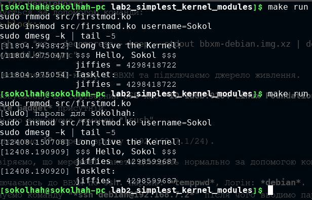

=====================
Лабораторна робота №2
=====================
**Завдання:**

* подправить модуль из примера, что бы вместо ``username``, выводилось имя, переданное в качестве параметра модуля при его подключении ``insmod``

* изучить материалы INOB

* добавить в ``init`` полученного модуля ядра тасклет, который также выведет текущее значение jiffies

* объяснить, почему разница между двумя выводимыми jiffies (в init и в тасклете) может быть равна 0, 1 или 2

---------------------

**Хід роботи:**

* Для виконання даної лабораторної роботи необхідно було спочатку на х86 завантажити пакет для оновлення ядра до версії ``4.19.69-1``. Для цього було встановлено за допомогою команди:
.. code-block::

  pacman -Syy linux419 linux419-headers  linux419-ndiswrapper

* Далі було зібрано модуль ядра, який створює вихідний файл *firstmod.ko*. Виконується за допомогою ``sudo insmod``. 

* Для логів ядра(останніх 5 рядків) використовуємо: ``sudo dmesg -k | tail -5``

* Для вигруження модуля використовуємо: ``sudo rmmod``

* Далі необхідно було виміряти час між двома включеннями модуля на х86 та ВВХМ, інтервал між якими був 10 хвилин. 
  Результатом для х86 наведено нижче:

* Результатом розрахунків отримаємо: 
  (4298599687 - 4298418722) / 300 = 603,21 секунд(603216 мілісекунд).
  
---------------------

**Висновок:**

Проаналізувавши даний результат можна сказати, що в теорії було розраховано очікувати результат 600 секунд, але за рахунок похибки, яка складає 0,5%. Звідси можна сказати що результат є саме таким, який повинен бути. Тому, значення jiffies можна вважати реальним годинником. Якщо глобальніше дізнатись про це значення, то дана змінна показує кількість імпульсів системного таймеру, які були отримані з моменту завантаження системи. З даних свідчень можна сказати, що і для ВВХМ повинен бути приблизно такий же результат.

