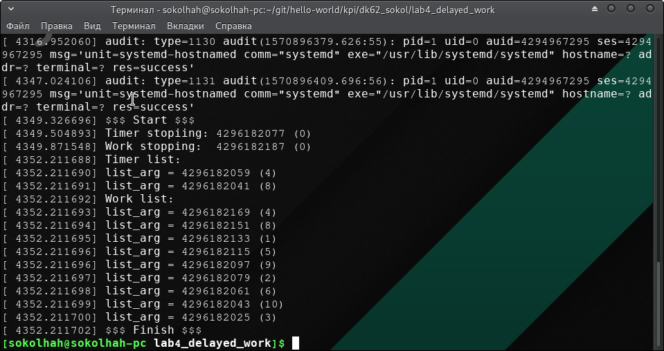
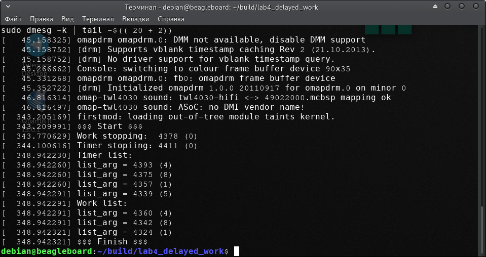

=====================
Лабораторна робота №4
=====================
**Завдання:**

- За основу можно взять код из предыдущей лабораторной

- Изучить особенности работы таймеров и ``workqueue``

- Реализовать два потока, запустить таймер и ворк в shared workqueue

- При срабатывании таймера проверить текущее значение ``jiffies`` , если оно кратно 11 – остановить поток 1, иначе – таймер должен перезапустить себя через 17 ``jiffies``

- Внутри ворка проверить текущее значение ``jiffies`` , если оно кратно 11 – остановить поток 2, иначе – ворк должен уснуть на 17 ``jiffies`` и перезапустить себя

- Добавить два связных списка, в которые аллоцировать и добавлять элементы со значениями ``jiffies`` , которые не привели к завершению потоков 1 и 2. Получается связь таймер - список 1 - поток 1. И ворк - список 2 - поток 2

- При выходе из потоков распечатывать списки

- Внутри ворка и таймера использовать правильные аллокации для новых элементов списка, правильную синхронизацию работы со списком

- Предусмотреть, что пользователь может выгрузить модуль до отработки всех таймеров и ворков

--------------------

**Коротко про workqueue:**

- ``workqueue`` є дуже схожими з ``tasklet`` . 

- Вони можуть служити для обробки переривань, 

- виконуються в контексті ``kernel`` - процеса, тому вони не обов'язково можуть бути атомарними 

- можуть використовувати функції для синхронізації

- такі функції можуть спати
 
--------------------

**Хід роботи:**

- Для початку було побудовано 2 зв'язані списки, тому для цього, як і в минулій лабораторній роботі їх було ініціалізово:

.. code-block::

  INIT_LIST_HEAD(&res_list1.list);
  INIT_LIST_HEAD(&res_list2.list);

- Для роботи з цими списками було використано структуру ``result`` :

.. code-block::

  struct result {
	struct list_head list;
	long int num;
  };
  struct result res_list1, res_list2;
  struct result *work_ptr = NULL;
  struct result *timer_ptr = NULL;

- Далі необхідно створити 2 потоки та виділити для них пам'ять. Перший потік необхідний для підтримки таймера, а другий для - ``workqueue`` .

- Для створення таймера використовується функція ``timer_setup()`` , який має 3 аргументи(відповідний таймер; функція, яка виконується при закінченні таймера; будь-які прапорці ``TIMER_``). Маються такі прапорці:

  * ``TIMER_DEFERRABLE`` : таймер, що відкладається, буде працювати нормально, коли система зайнята, але не призведе до того, що процесор вийде з режиму очікування просто для його обслуговування; натомість таймер буде обслуговуватися, коли процесор врешті-решт прокинеться з наступним таймером, який не відкладається.

  * ``TIMER_IRQSAFE`` : Таймер ``irqsafe`` виконується з відключеним ``IRQ`` , і безпечно чекає завершення запущеного примірника від обробників ``IRQ`` , наприклад, викликавши ``del_timer_sync()`` .
 
  * Примітка: Виконання відключеного виклику ``irq`` - це особливий випадок, коли виникає проблема блокування робочих черг. Він не призначений для виконання випадкових лайнів із відключеннями переривань. Зловживання контролюються!

  * ``TIMER_PINNED`` : На закріплений таймер, не впливатиме ніяка евристика розміщення таймера (наприклад, ``NOHZ`` ) і завжди закінчується в процесорі, на якому був задіяний таймер.

  * Примітка: Оскільки замикання таймерів може перенести таймер з центрального процесора на інший, закріплені таймери не гарантовано залишаються на початково вибраному процесорі. Вони переміщуються до центрального процесора, на який функція ``enqueue`` викликається через ``mod_timer()`` або ``add_timer()`` . Якщо таймер слід розмістити на певному процесорі, тоді слід використовувати ``add_timer_on()`` .

.. code-block::
  struct timer_list timer;
  timer_setup(&timer, &timer_func, 0);

- Далі викорисовуємо функцію ``mod_timer()`` . Вона використовується для того, щоб змінити час закінчення терміну дії таймера. В нашому випадку таймер буде діяти 1 ``jiffies`` :

.. code-block::

  mod_timer(&timer, jiffies + 1);

- Для регулювання ввімкнення таймера та ``workqueue`` використовуються 2 флаги:

.. code-block::

  struct st_flags {
	bool timer_run;
	bool work_run;
  };
  struct st_flags flags;

- Створивши потік для таймера, необхідно зборити так, щоб коли ``jiffies`` кратне 11 - потік зупинявся, а в іншому випадку потік повинен перезапустити себе через 17 ``jiffies``, тому потік та таймер мають відповідні функції:

.. code-block::

  static int t_func1(void *data)
  {
	while (flags.timer_run) {
		schedule();
	}
	return 0;
  }

  void timer_func(struct timer_list *data)
  {
	if ((jiffies % 11) == 0) {
		printk(KERN_INFO "Work stopping:  %li (%li)\n", jiffies, jiffies % 11);
		flags.timer_run = 0;
	} else {
		list_add_arg(timer_ptr, &res_list2.list, jiffies);
		mod_timer(&timer, jiffies + 17);
	}
  }

- Для операцій зі списком було додано 3 функції:
``list_add_arg()`` - додавання аргумента до списку:

.. code-block::

  static void list_add_arg(struct result *res, struct list_head *list_name, long int arg)
  {
	res = kmalloc(sizeof(*res), GFP_ATOMIC);
	res->num = arg;
	list_add(&res->list, list_name);		
  }

``list_print()`` - роздрукування списка:

.. code-block::

  static void list_print(struct list_head *name_list)
  {
	struct result *temp;
	list_for_each_entry(temp, name_list, list) {
		printk(KERN_NOTICE "list_arg = %li (%li)", temp->num, temp->num % 11);
	}
  }

та ``list_destroy()`` - руйнування(видалити) списка:

.. code-block::

  static void list_destroy(struct list_head *name_list)
  {
	struct result *cursor, *tmp;
	list_for_each_entry_safe(cursor, tmp, name_list, list) {
		list_del(&cursor->list);
		kfree(cursor);
	}
  }

- Далі реалізовуємо ``workqueue``. Для початку ініціалізуємо його:

.. code-block::

  struct delayed_work work;
  INIT_DELAYED_WORK(&work, work_func);

та запускаємо за допомогою виконується аналогічно до таймерів функція schedule_delayed_work(), де перший аргумент є робота, яку необхідно виконати, а другим - кількість ``jiffies`` для очікування виконання роботи:

.. code-block::

  schedule_delayed_work(&work, 1);

- Далі виконуються аналогічно схожі функції з таймером для ``workqueue``:

.. code-block::

  void work_func(struct work_struct *data)
  {
	if ((jiffies % 11) == 0) {
		printk(KERN_INFO "Timer stopiing: %li (%li)\n", jiffies, jiffies % 11);
		flags.work_run = 0;		
	} else {
		list_add_arg(work_ptr, &res_list1.list, jiffies);
		schedule_delayed_work(&work, 17);
	}
  }

- Результатом роботи є:
для платформи ``х86`` :

та для платформи ``arm`` :

--------------------

**Висновок:**

Отже, з рисунку платформи ``arm`` можна зробити висновок:

- функція ``work`` та ``таймер'' мають синхронізацію (спочатку виконувався ворк(4324 ``jiffies`` ), далі таймер(4339 ``jiffies`` ), після чого знову ворк(4342 ``jiffies`` ) і т.д.; 

- різниця між кожним наступним записаним значенням ``jiffies`` у ворка або таймера дорівнює 18, що є вірним результатом; 

- ворк та таймер зупинився на значенні кратному 11, що є таком вірним результатом. 

Звідси можна сказати, що результати здійснились очікуванним значенням. Аналогічним висновком є для платформи ``x86`` .

