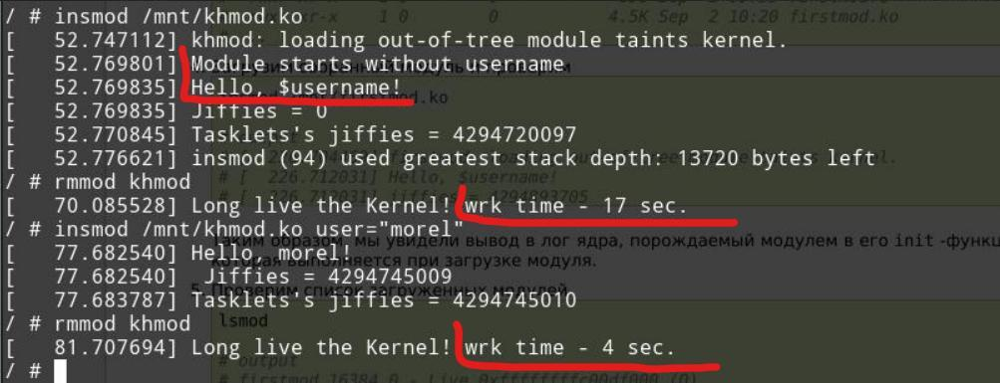

==========================================================
**Лабораторна робота №1 Введення в розробку модулів ядра**
==========================================================

**Завдання:**
~~~~~~~~~~~~~
* Зібрати мінімальний модуль Linux-ядра вручну;
* Зібрати мінмальне Linux-оточення з використання BusyBox;
* Зібрати перший модуль ядра;
* Написати та зібрати власний модуль ядра який:
    * Виводить ім'я користувача передане в якості параметру модуля при його підключенні. Якщо параметр не задано, вивести попередження;
    * Доповнити *exit_callback* модуля, щоб він виводив значення *jiffies* та час в секундах від *init* до *exit*.

**Хід роботи:**
~~~~~~~~~~~~~~~
За основу власного модуля взято демонстративний модуль ``firstmodule``.

**Використані бібліотеки**
--------------------------

* ``<linux/module.h>`` потрібна для всіх модулів;
* ``<linux/kernel.h>`` використовується для *sysinfo*;
* ``<linux/init.h>`` використовується для ініціалізації та закриття;
* ``<linux/jiffies.h>`` тут "живе" лічильник та допоміжні функції;
* ``<linux/interrupt.h>`` використовується для *tasklets*;

**Використані макроси та функції**
----------------------------------

``MODULE_DESCRIPTION`` макрос для опису модуля;

``MODULE_AUTHOR`` автори модуля;

``MODULE_VERSION`` версія модуля;

``MODULE_LICENSE`` тип ліцензії. У нас подвійна, MIT/GPL;

``module_param`` використовується для передачі параметрів в модуль;

``jiffies_delta_to_msecs`` використовується для розрахунку проміжку часу. На вхід очікує різницю *jiffies*;

``tasklet_schedule`` та ``tasklet_kill`` використовується для планування задачі на виконання, та видалення відповідно;

``printk`` використовується для виведення інформації в консоль;

``DECLARE_TASKLET`` - макрос що використовується для оголошення таскліта, перший параметр - ім'я, другий - функція обробник, третій - параметри що передаються.

Висновки
~~~~~~~~

Було зібрано модуль ядра та перевірено його працездатність. На скріншоті нижче показано результати виконання модулю з передачею параметра ``user`` та без.
При передачі без параметра, виводиться warning. Також при вигрузці модуля виводиться час його роботи в секундах.

