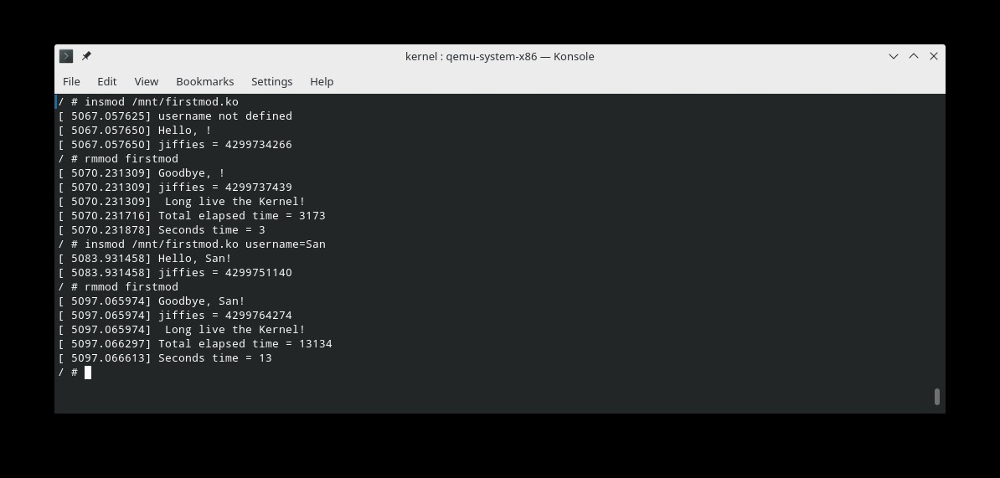

==========================================================
**Лабораторна робота №1 Введення в розробку модулів ядра**
==========================================================

**Завдання:**
~~~~~~~~~~~~~
*Зібрати модуль Linux-ядро;
*Зібрати Linux-оточення з використання BusyBox;
*Написати та зібрати власний модуль ядра, який може:
- Виводити ім'я користувача передане в якості параметру модуля при його підключенні. Якщо параметр не задано, вивести попередження;
- Доповнити *exit_callback* модуля, щоб він виводив значення *jiffies* та час в секундах від *init* до *exit*.

**Хід роботи:**
~~~~~~~~~~~~~~~
1)
   ``sudo pacman -S base-devel qemu qemu-arch-extra bc cpio``

2) 
      ``mkdir -p ~/kernel``
      
      ``tar -xJvf linux-*.tar.xz -C ~/kernel/``
      
3) 
   ``make distclean``.
   
   ``make defconfig``. 
      
   ``make menuconfig``. (setings)
   
   ``make -jN`` (N==cores+1)
   
   ``make -jN bzImage`` (N==cores+1)
   
4) 
    ``qemu-system-x86_64 -no-kvm -m 256M -smp N -kernel "arch/x86_64/boot/bzImage" -append "console=ttyS0"`` (N==cores+1)
   
5) BusyBox  (setings) 
   ``make menuconfig``.
   
   ``make -jN`` (N==cores+1)
   
   ``make CRYPT_AVAILABLE=n -jN`` (N==cores+1)
         
   ``make -jN install`` (N==cores+1)
    
.. code-block:: bash
      
      cd _install
      mkdir proc
      mkdir sys
      chmod 555 proc
      chmod 555 sys
   
   Створимо файл ``/init``, який ядро зробить зразу після закінчення початкових этапів після запуску.
   
      ``find . -print0 | cpio --null --owner=0:0 -ov --format=newc | gzip -9 > ../../initramfs.cpio.gz``
   
 6)  
 ``qemu-system-x86_64 -enable-kvm -m 256M -smp 4 -kernel "./bzImage" -initrd "./initramfs.cpio.gz" -append "console=ttyS0" -nographic``
   
   Результат:

   .. image:: doc/linux.jpg

*Використані бібліотеки*
--------------------------

* ``<linux/module.h>`` потрібна для всіх модулів;
* ``<linux/kernel.h>`` використовується для *sysinfo*;
* ``<linux/init.h>`` використовується для ініціалізації та закриття;
* ``<linux/jiffies.h>`` лічильник кількості тактів;

*Використані макроси та функції*
----------------------------------

``MODULE_DESCRIPTION`` макрос для опису модуля;

``MODULE_AUTHOR`` автор модуля;

``MODULE_VERSION`` версія модуля;

``MODULE_LICENSE`` тип ліцензії. Якщо виходимо за рамки однієї, то діє інша. У нас подвійна, MIT/GPL;

``module_param`` використовується для передачі параметрів в модуль(тип даних права доступу); module_param(username, charp, 0000)

де  *username* - назва зміної, *charp* - тип даних параметру(вказівник на рядок символів), *0000* - права доступу;

``jiffies_delta_to_msecs`` використовується для розрахунку проміжку часу.

``printk`` використовується для виведення інформації в консоль. Ось її макроси:

* ``KERN_EMERG`` - система не використовується;        

* ``KERN_ALERT`` - дія повиина бути прийнята негайно;  

* ``KERN_CRIT`` - критичні умови;

* ``KERN_ERR`` - умови помилки;  

* ``KERN_WARNING`` - умови попередження;

* ``KERN_NOTICE`` - Нормальний, але заслуговує на увагу стан;

* ``KERN_INFO`` - інформаційне повідомлення;

* ``KERN_DEBUG`` - cповіщення рівня налагоджування.

*Jiffies*
----------------------------------

``jiffies`` - Глобальна змінна містить кількість тіків таймера з моменту завантаження системи (unsigned long).
Перетворення між джифами та секундами
* ``jiffies = seconds * HZ``
* ``seconds = jiffies / HZ`` HZ - кількість переривань системного таймера за 1 секунду. 
*sizeof (jiffies) - 32 біти для 32-розрядних архітектур і 64 біти для 64-розрядних архітектур
*Для 32-бітової змінної з HZ == 100 переповнення за 497 днів
*Для 32 бітах з HZ == 1000, переповнення через 50 днів
*Але для 64-бітної змінної дуже довгий час немає переповнення

Ядро відстежує потік часу за допомогою таймерних переривань. Таймерні переривання генеруються системою синхронізації системи через рівні проміжки часу; цей інтервал програмується ядром під час завантаження відповідно до значення HZ, яке є залежним від архітектури значенням, визначеним у <linux / param .h>. Значення за замовчуванням у розподіленому джерелі ядра коливаються від 50 до 1200 тиків на секунду на реальному обладнанні, до 24 для програмних симуляторів. Більшість платформ працюють зі 100 або 1000 перериваннями в секунду; популярний ПК x86 за замовчуванням становить 1000, хоча раніше він був 100 у попередніх версіях (до 2,4 включно). Як правило, навіть якщо ви знаєте значення Гц, ви ніколи не повинні розраховувати на це конкретне значення під час програмування. Можна змінити значення ГЦ для тих, хто хоче системи з різною частотою переривань годин. Якщо ви змінили HZ у файлі заголовка, вам потрібно перекомпілювати ядро ​​та всі модулі з новим значенням. Можливо, ви захочете підняти HZ, щоб отримати більш чітке роздільну здатність у своїх асинхронних завданнях, тоді ви готові платити за додаткові переривання таймера для досягнення ваших цілей. Насправді підвищення HZ до 1000 було досить поширеним явищем у промислових системах x86 із використанням версії 2.4 або 2.2 ядра. Однак у поточних версіях найкращим підходом до переривання таймера є дотримання значення за замовчуванням для HZ, завдяки нашій повній довірі до розробників ядра, які, безсумнівно, обрали найкраще значення. Крім того, деякі внутрішні обчислення в даний час реалізуються лише для HZ в діапазоні від 12 до 1535. Кожного разу, коли виникає переривання таймера, значення внутрішнього лічильника ядра збільшується. Лічильник ініціалізується до 0 при завантаженні системи, отже, він представляє кількість тактів годин з часу останнього завантаження. 

В папці з змейком та програмою:

``make KBUILDDIR="~/kernel/linux-5.8.7" modules``

далі в папці Kernel

.. code-block:: bash
      
      # here ./lab1 is our directory with built module
      qemu-system-x86_64 -enable-kvm -m 256M -smp 4 -kernel "./bzImage" -initrd "./initramfs.cpio.gz" \
                         -append "console=ttyS0" -nographic \
                         -drive file=fat:rw:./lab1,format=raw,media=disk
``mkdir /mnt``
``mount -t vfat /dev/sda1 /mnt``
``insmod /mnt/firstmod.ko``
``rmmod firstmod``

Результат:

*Використані джерела*
--------------------------

https://www.kernel.org/doc/html/latest/core-api/printk-basics.html
https://tldp.org/LDP/lkmpg/2.6/html/x323.html
https://tldp.org/LDP/lkmpg/2.6/html/x245.html
https://www.opennet.ru/man.shtml?topic=printk&category=9&russian=2
https://static.lwn.net/images/pdf/LDD3/ch07.pdf
https://www3.cs.stonybrook.edu/~dongyoon/cse506-f19/lecture/lec17-timer.pdf

**Висновки**
~~~~~~~~~~~~

Було зібрано справжній модуль Linux-ядра, зібрано Linux-оточення з використання BusyBox, а також написано та зібрано власний модуль ядра, який приймає ``username``, фіксує ``jiffies`` на завантаженні та відвантаженні модуля та переводить різницю цих ``jiffies`` у хвилини. Розмір ядра, враховуючи всі методичні та "дефолтні" налаштування склав 600 з лишком МБ, а bzImage важить 8 з лишком МБ. 
