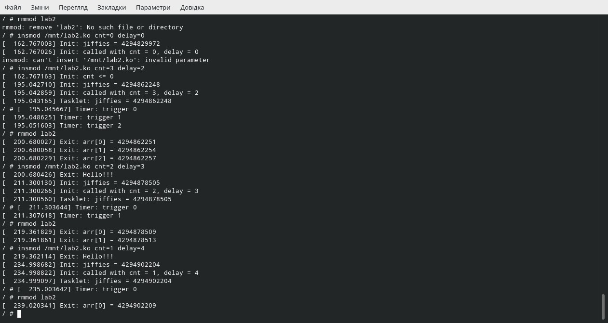

================================================================
**Лабораторна робота №2 Таймери, тасклети та аллокоція пам'яті**
================================================================

**Завдання:**
~~~~~~~~~~~~~

  - Ознайомитися з таймерами та тасклетами;
  - Написати модуль ядра, який буде приймати на вхід параметри `cnt` та `delay`
    - `cnt` відповідає за кількість циклів відпрацювання тамера
    - `delay` відповідає за затримку між двома відпрацюваннями таймера;
  - При `__init`, записати лог ядра значення `jiffies`
    - після цього викликати тасклет, для запису знаечення `jiffies` в лог ядра;

**Хід роботи:**
~~~~~~~~~~~~~~~

Було створено модуль згідно завдання. Необхідно було дослідити матеріали в інтернеті, щоб розібратись у тонкощах тасклетів таймерів та аллокації пам'яті. Відповідні матеріали у списку використаних джерел. Результати створеного модуля можна побачити на скріншоті. 

*Тасклети*
----------------------------------

Тасклет - достатньо складна річ, яка виконує відкладену обробку переривань, це щось на зразок дуже маленького потоку, у якого немає ні свого стека, ні контексту.Такі "потоки" відпрацьовують швидко і повністю. Різні ``tasklet`` можуть виконуватися паралельно, але при цьому сам з собою він одночасно не викликається, оскільки виконується тільки на одному ядрі,першим, який запланував його виконування. ``Tasklet`` виконуються за принципом невитісняючі планування,один за іншим, в порядку черги. Можна планувати з двома різними пріоритетами: ``normal`` і ``high`` .

Спочатку потрібно задекларувати тасклет.
Для цього викликаємо ``DECLARE_TASKLET(tasklet, tasklet_handler, 0)``, де ``tasklet``- ім'я тасклету, ``tasklet_handler`` - функція-обробник,
``0``- аргумент, що передається в функцію обробник. В цьому випадку значення передавати в функцію не потрібно, 
тому я вказав на місці фактичного аргументу ``__unsed`` ,що означає, що функіція не прийматиме аргумет.
Щоб вивести значення *jiffies* за дапомогою тасклету, я в функції ``tasklet_handler``
за допомогою ``printk`` вивожу значення ``jiffies``.

Перед викликом тасклета, його роботу потрібно запланувати та поставити в чергу.
Цю дію виконує функція ``tasklet_schedule()``, також є функції ``tasklet_hi_schedule`` ``tasklet_hi_schedule_first``, 
що відрізняються приорітетом виконання.  
Після виконання тасклет повинен бути видалений з черги на виконання, це робить функція ``tasklet_kill()``.

*Таймери ядра*
-----------------------------------

Всякий раз, коли потрібно запланувати дію, яка відбудеться пізніше, не блокуючи поточний процес до настання цього часу, тоді таймери ядра - це інструмент для вас. Ці таймери використовуються для планування виконання функції на певний час у майбутньому, на основі тіка годинника, і можуть використовуватися для різноманітних завдань; наприклад, опитування пристрою, перевіряючи його стан через рівні проміжки часу, коли обладнання не може запускати переривання. Іншим типовим використанням таймерів ядра є вимкнення тривалої операції. У таких випадках затримка повернення зблизька призведе до непотрібних (і дивних) витрат на прикладну програму. Нарешті, саме ядро ​​використовує таймери в декількох ситуаціях, включаючи реалізацію schedule_timeout.

Таймер ядра - це структура даних, яка вказує ядру виконувати користувацьку функцію з користувацьким аргументом у визначений користувачем час. Реалізація знаходиться в <linux / timer.h> та ядрі / timer.c

Функції, заплановані для запуску, майже напевно не запускаються, поки виконується процес, який їх зареєстрував. Натомість вони працюють асинхронно. До цього часу все, що ми робили в наших зразках драйверів, працювало в контексті процесу, що виконує системні виклики. Однак під час запуску таймера процес, який запланував його, може бути сплячим, виконуватися на іншому процесорі або, цілком можливо, взагалі вийшов.

Це асинхронне виконання нагадує те, що відбувається, коли відбувається апаратне переривання. Насправді таймери ядра запускаються в результаті "програмного переривання". Під час запуску в такому атомному контексті код піддається ряду обмежень. Функції таймера повинні бути атомарними всіма способами, але є деякі додаткові проблеми, викликані відсутністю контексту процесу. Повторення вимагається, оскільки правила атомного контексту повинні бути ретельно дотримані, інакше система опиниться в глибоких неприємностях.

Для виконання ряду дій необхідний контекст процесу. Коли ви знаходитесь поза контекстом процесу (тобто в контексті переривання), ви повинні дотримуватися наступних правил:

Немає доступу до простору користувача. Оскільки не існує контексту процесу, немає шляху до простору користувача, пов'язаного з яким-небудь конкретним процесом.

Поточний вказівник не має значення в атомному режимі і не може використовуватися, оскільки відповідний код не має зв'язку з перерваним процесом.

Ніякого сну або планування не може бути виконано. Атомний код не може викликати графік або форму wait_event, а також не може викликати будь-яку іншу функцію, яка може перестати працювати. Наприклад, виклик kmalloc (..., GFP_KERNEL) суперечить правилам. Також не можна використовувати семафори, оскільки вони можуть спати.

Код ядра може визначити, чи працює він в контексті переривання, викликаючи функцію in_interrupt (), яка не приймає ніяких параметрів і повертає ненульове значення, якщо процесор зараз працює в контексті переривання, або апаратне переривання, або програмне переривання.

Функція, пов’язана з in_interrupt (), є in_atomic (). Його повернене значення ненульове, коли планування не дозволяється; це включає апаратні та програмні контексти переривань, а також будь-який час, коли проводиться спінлок. В останньому випадку струм може бути дійсним, але доступ до користувацького простору заборонений, оскільки це може спричинити планування. Кожного разу, коли ви використовуєте in_interrupt (), ви дійсно повинні розглянути, чи in_atomic () є тим, що ви насправді маєте на увазі. Обидві функції оголошені в <asm / hardirq.h>

Ще однією важливою особливістю таймерів ядра є те, що завдання може перереєструватися для повторного запуску пізніше. Це можливо, оскільки кожна структура timer_list від’єднується від списку активних таймерів перед запуском і, отже, може бути негайно повторно пов’язана в іншому місці. Хоча перепланування одного і того ж завдання знову і знову може здатися безглуздою операцією, іноді це корисно. Наприклад, його можна використовувати для здійснення опитування пристроїв.

Однак важливою особливістю таймерів, про яку не слід забувати, є те, що вони є потенційним джерелом гонок навіть на однопроцесорних системах. Це прямий результат їхньої асинхронності з іншим кодом. Отже, будь-які структури даних, до яких отримує доступ функція таймера, повинні бути захищені від одночасного доступу, або атомними типами, або за допомогою спіноблоків.

*kmalloc ()*
------------------------------------

Функція kmalloc () подібна до роботи знайомої підпрограми malloc () користувальницького простору, за винятком додаткового параметра прапорів. Функція kmalloc () - це простий інтерфейс для отримання пам'яті ядра в шматки байтового розміру. Функція оголошена в <linux / slab.h>: void * kmalloc (size_t size, gfp_t flags). Область виділеної пам'яті фізично суцільна. При помилці повертає NULL. Розподіл ядра завжди вдається, якщо недостатньо обсягу пам'яті. Таким чином, ви повинні перевірити наявність NULL після всіх викликів kmalloc () та обробити помилку належним чином. 

*kfree ()*
------------------------------------

Аналогом kmalloc () є kfree (), який оголошено в <linux / slab.h>: void kfree (const void * ptr). Метод kfree () звільняє блок пам'яті, раніше виділений kmalloc (). Не викликайте цю функцію в пам'яті, якщо раніше не виділений kmalloc (), або в пам'яті, яка вже звільнена. Це робить помилку, що призводить до поганої поведінки, наприклад, звільнення пам'яті, що належить іншій частині ядра. Як і в просторі користувача, будьте обережні, щоб збалансувати свої розподіли з вашими звільненнями, щоб запобігти витоку пам'яті та іншим помилкам. Зверніть увагу, що виклик kfree (NULL) явно перевіряється і безпечний. 

*kzalloc ()*
------------------------------------

База коду ядра повна функцій, які виділяють пам'ять за допомогою kmalloc (), а потім обнуляють її за допомогою memset (). Більшу частину коду можна очистити, використовуючи замість цього kcalloc (). kcalloc () має такий прототип:

    ``void * kcalloc (size_t n, size_t size, unsigned int __nocast gfp_flags);``

Ця функція виділить масив з n елементів і обнулить весь масив, перш ніж повернути його звернення. 

Насправді дуже мало абонентів мають виділяти масив елементів, тому додатковий аргумент у більшості випадків непотрібний. Екземпляр цього аргументу трохи додає розмір ядра, і з часом цей простір додається. Рішенням було створити ще одну функцію розподілу:

    ``void * kzalloc (size_t size, unsigned int __nocast gfp_flags);``

Ці підпрограми маллокації використовуються для динамічного запиту вирівняних фрагментів пам'яті, як malloc та free do у просторі користувачів, але kmalloc () бере додаткове слово прапора. Важливі прапорці:

*GFP_KERNEL*
 ------------------------------------

Може спати і міняти місцями, щоб звільнити пам’ять. Дозволено лише в контексті користувача, але це найнадійніший спосіб розподілу пам'яті.

*GFP_ATOMIC*
-------------------------------------

Не спить. Менш надійний, ніж GFP_KERNEL, але може бути викликаний із контексту переривання. Треба мати хорошу стратегію обробки помилок недостачі пам’яті.

*GFP_DMA*
-------------------------------------

Виділення ISA DMA менше 16 МБ. Якщо ви не знаєте, що це, вам це не потрібно. Дуже ненадійно.

Якщо ви бачите сплячу функцію, що викликається з повідомлення про попередження, то, можливо, ви викликали функцію розподілу сну з контексту переривання без GFP_ATOMIC. Тоді слід справді це виправити.

В папці з змейком та програмою:

``make KBUILDDIR="~/kernel/linux-5.8.7" modules``

далі в папці Kernel:

.. code-block:: bash
      
      # here ./lab2 is our directory with built module
      qemu-system-x86_64 -m 256M -smp 4 -kernel "./bzImage" -initrd "./initramfs.cpio.gz" \
                         -append "console=ttyS0" -nographic \
                         -drive file=fat:rw:./lab2,format=raw,media=disk
``mkdir /mnt``
``mount -t vfat /dev/sda1 /mnt``
``insmod /mnt/lab2.ko``
``rmmod lab2``

Результат:

*Використані джерела*
--------------------------

https://www.kernel.org/doc/htmldocs/kernel-hacking/routines-kmalloc.html

https://bootlin.com/doc/books/ldd3.pdf#page=231

https://www.kernel.org/doc/html/latest/core-api/memory-allocation.html

https://www.kernel.org/doc/html/latest/core-api/mm-api.html#the-slab-cache

https://www.kernel.org/doc/html/latest/core-api/mm-api.html#memory-allocation-controls

https://www.doc-developpement-durable.org/file/Projets-informatiques/cours-&-manuels-informatiques/Linux/Linux%20Kernel%20Development,%203rd%20Edition.pdf#page=258

http://www.makelinux.net/ldd3/?u=chp-7-sect-4.shtml

https://lwn.net/Articles/735887/

https://www.doc-developpement-durable.org/file/Projets-informatiques/cours-&-manuels-informatiques/Linux/Linux%20Kernel%20Development,%203rd%20Edition.pdf#page=249

https://www.kernel.org/doc/html/latest/driver-api/basics.html?#delaying-scheduling-and-timer-routines

http://www.makelinux.net/ldd3/?u=chp-7-sect-5.shtml

https://www.doc-developpement-durable.org/file/Projets-informatiques/cours-&-manuels-informatiques/Linux/Linux%20Kernel%20Development,%203rd%20Edition.pdf#page=163

https://www.doc-developpement-durable.org/file/Projets-informatiques/cours-&-manuels-informatiques/Linux/Linux%20Kernel%20Development,%203rd%20Edition.pdf#page=169

https://lwn.net/Articles/147014/

**Висновки**
~~~~~~~~~~~~

Було зібрано свій модуль ядра, що відповідає завданню та перевірено його працездатність, вивчена документація на процес розробки модулів ядра.           
Jiffies в init та tasklet відрізняється, тому що від початку ініціалізації до запуску тасклету проходить чимало часу, за цей час потік модуля міг перериватися або взагалі витіснятися іншими потоками.         
Для виділення памяті в init був використаний флаг GFP_KERNEL, тому що init може спати без негативних наслідків.           
При delay рівним нулю таймер буде відпрацьовувати з мінімальною затримкою, зазвичай це 1 такт. 

Jiffies, яке друкується в *init* і яке виводиться тасклетом відрізняється тому що між цими двома подіями проходить деякий час, а також потік модуля міг перериватись

При виділенні пам'яті використовувався флаг `GFP_KERNEL` тому що(на скільки я зрозумів) `GFP_KERNEL` "заганяє" процес, який викликав функцію виділення пам'яті, в "сон" і при відсутності вільної необхідної кількості пам'яті намагається виконати певні дії для того, щоб ця пам'ять "з'явилась". На це все потрібен час. І оскільки процес, який викликав функцію виділення пам'яті не критичний до часу, то було використано саме цей флаг.

Jiffies між двома запусками таймера дорівнює `msecs_to_jiffies(delay)` + деяке невелике число. Так відбувається(на скільки я зрозумів) тому, що ми зчитуємо значення *jiffies* не в момент, коли воно змінюється і ми перейшли у обробник таймеру. І при великих *delay* ця різниця також стає більшою.

Результати джиффів не дуже сильно відрізняються, це пояснюється тим, що між виконанням обох запитів проминуло не так багато часу. Проте, наскільки я зрозумів, якщо процессор буде надто завантажений, або на виконання прийдуть таксклети з більш високим пріорітетом, виконання даного таксклету може буди відкладене, а отже значення jiffies за цей час може збільшитись, и тоді вони можуть відрізнятися на 1 чи на 2 значення.

