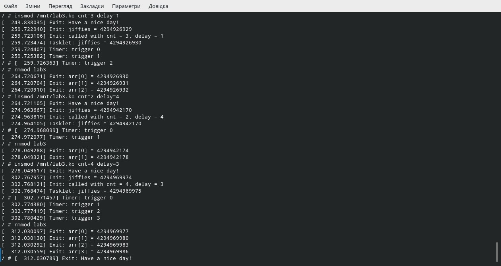
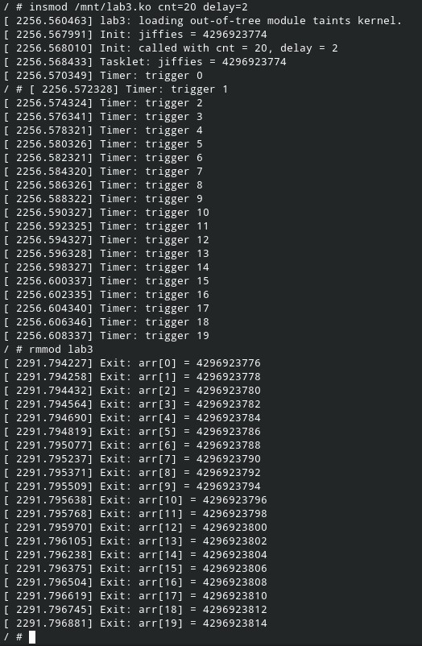

=============================================
Лабораторна робота №3 High-Resolution timers
=============================================

Завдання:
-------
Написати модуль ядра, який:
	* Приймає параметр *cnt* - кількість циклів, які повинен опрацювати *hr-таймер* 
	* Приймає параметр *delay* - являється затримкою між двума спрацюваннями *hr-таймера*
	* Спочатку роботи модуля, він повинен надрукувати поточне значення *jiffies*
	* Після цього запускає тасклет, який повинен надрукувати власне значення *jiffies
	* init запускає *hr-таймер* з затримкою *delay* і функція завершається
	
Хід роботи
-------

Ядро ​​має два основних механізми таймера. Один з них - підсистема таймера з високою роздільною здатністю 
(або "hrtimer"), орієнтована на короткотермінові події, коли очікується, що таймер працюватиме до кінця.
Інша підсистема просто називається "таймерами ядра"; він пропонує меншу точність, але є більш ефективним 
у ситуаціях, коли таймер, ймовірно, буде скасовано до його спрацьовування. У ядрі є багато місць, де таймери 
використовуються для виявлення випадків, коли пристрій або мережевий сервер не відповідають протягом очікуваного часу; 
коли, як зазвичай, очікувана відповідь все ж відбувається, таймер скасовується. Таймери ядра добре підходять 
для такого використання

В ході виконання лабораторної роботи, було поставлене завдання використовувати таймери з високою
роздільною здатністю. Ці таймери забезпечують високу точність і управління таймерами. Вони функціонують
з гранулярністю в наносекунди і цей час представлено в спеціальному типу ktime. При роботі з hrtimers 
існує відмінність між абсолютним і відносним часом, і при виклику слід вказувати необхідний тип.

hr-таймери представлені структурою *hrtimer*. В ній визначаються компоненти таймера, які будуть необхідні
користувачеві. Вказується інформація, яка використовується для управління. Процес починається з 
ініціалізації таймера за допомогою *hrtimer_init*. В цю функцію передається ім"я таймера, визначається
тип часу(структура *clockid_t*) і режим таймера(чи буде він працювати одноразово, чи перезапускатись).

Таймер ініціалізовано і його потрібно запустити. Цей крок виконується за допомогою *hrtimer_start*. 
У цьому виклику вказується час спрацювання таймера (який ініціалізовано в *ktime_t*) і режим для значення
часу - абсолютний або відносний час. Після спрацювання таймера його роботу можна закінчити за допомогою
*hrtimer_cancel*. Ця функція буде чекати завершення функції зворотнього визову. 

В папці з змейком та програмою:

``make KBUILDDIR="~/kernel/linux-5.8.7" modules``

Далі в папці Kernel:

``qemu-system-x86_64 -m 256M -smp 4 -kernel "./bzImage" -initrd "./initramfs.cpio.gz" \ -append "console=ttyS0" -nographic \ -drive file=fat:rw:./lab3,format=raw,media=disk``

Потім:   

``mkdir /mnt``
``mount -t vfat /dev/sda1 /mnt``
``insmod /mnt/lab3.ko``
``rmmod lab3``

Результат:

Висновки
-------

Зробивши висновки по виконаній роботі, можна відзначити, що *hr-таймери* є більш точними за стандартні
таймери ядра. Це випливає з того, що *hr-таймери* мають більшу роздільну здатність - наносекунди, від 
стандартних - мілісекунди. Таймери з високою роздільною здітністю, зважаючи на всі висновки, можна
використовувати для ШІМ-модуляції.
