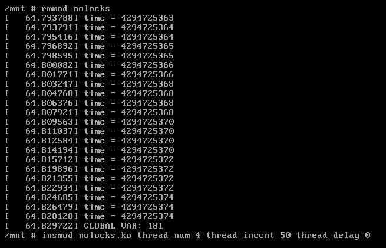
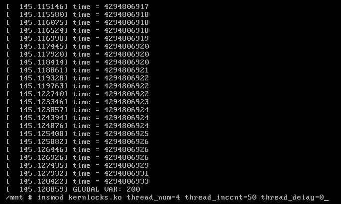
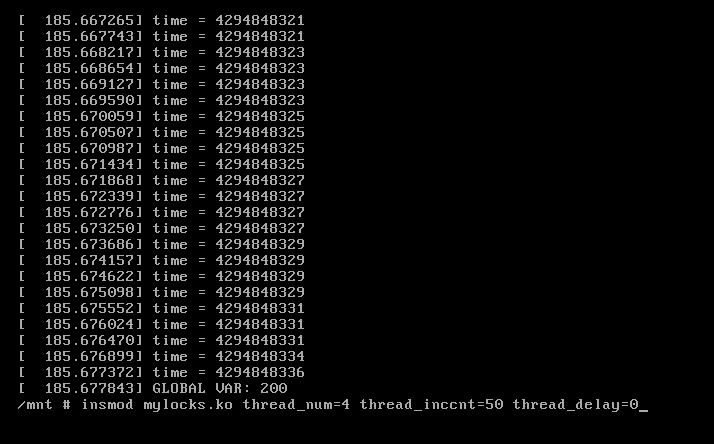

==========================================================
**Лабораторна робота №4. kernel threads and synchronization**
==========================================================

**Завдання:**
~~~~~~~~~~~~~
 
* Написати та зібрати власний модуль ядра, який:                  
    > содержит глобальную переменную glob_var и параметры thread_num, thread_inccnt, thread_delay      
    > запускает thread_num потоков на одновременное выполнение      
    > каждый поток инкрементирует переменную glob_var thread_inccnt раз с задержкой thread_delay (может быть 0 — в этом случае, без задержки), кладет значение переменной в список и завершается      
    > при выгрузке модуль выводит значение переменной glob_var и содержимое списка      
    > для переменной, списка, потоков использовать динамическую аллокацию. Переменную передавать в поток аргументом      
    > предусматривает возможность досрочной выгрузки и будет нормально отрабатывать в этом случае      
      
**Хід роботи:**
~~~~~~~~~~~~~~~
За основу власного модуля взято третю лабу. Подивився декілька сайтів з документацією на kthread api, LKD та способи реалізації спінлоків. Спочатку написав інтерфейс модуля, параметри та їх обробку. Потім написав функцію треда з запуском та зупинкою, і в останню чергу додав до програми linked list та роботу з ним.

Скріни роботи модулів:

**Використані бібліотеки**
--------------------------
    

* ``<linux/module.h>``				тут загальні макроси для модулів               	
* ``<linux/moduleparam.h>``			тут все для параметризації                    		
* ``<linux/kernel.h>``				тут заголовки ядра          	
* ``<linux/init.h>``				тут все для [де]ініціалізації          	
* ``<linux/jiffies.h>``				тут лічильник та допоміжні функції          	
* ``<linux/slab.h>``				тут і          	
* ``<linux/mm.h>``					тут засоби алокації пам'яті                 
* ``<linux/sched.h>``				тут плануівльник тредів       
* ``<linux/delay.h>``				тут затримки і функції сну       
* ``<linux/list.h>``				тут списки ядра       
* ``<linux/kthread.h>``				тут функції для роботи з тредами       
* ``<linux/types.h>``				тут тип atomic       
* ``<linux/spinlock.h>``			тут готові спінлоки       

Висновки
~~~~~~~~

Було зібрано свій модуль ядра, що відповідає завданню та перевірено його працездатність.         
Варіант без синхронізації, як і очікувалось працював неправильно, і якщо змінна втрачала біля 30% свого значення, то довжина списку скорочувалася в десять і більше разів. При додаванні спінлока все стало працювати правильно, також було написано свій спінлок за допомогою атомарних операцій і перевірено його роботу.   

