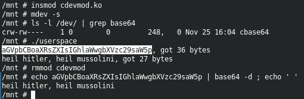

==========================================================
**Лабораторна робота №6. символьний пристрій**
==========================================================

**Завдання:**
~~~~~~~~~~~~~
   
— Напишите свое символьное устройство с ioctl. Оно должно делать что-то полезное. Например, предоставлять шареную память, или генерировать что-то, или рассчитывать. Например, считать количество вхождений определённого символа или сортировать строки или считать интеграл        
      

**Хід роботи:**
~~~~~~~~~~~~~~~
За основу власного модуля взято мкр. Вкрав звідти мільйон кода, написав свої варіанти функцій, додав клас та забезпечив розпізнавання девайсу за допомогою mdev. Вирішив робити модуль, який кодує/декодує текст в base64. Прописав ioctl з налаштуванням кодування/декодування та максимального розміру буферу. Пам'ять не тече. Також написав юзерспейс програму, яка тестує модуль.

Тест модуля:   

**Використані бібліотеки**
--------------------------
    
* ``include <linux/module.h>``        
* ``include <linux/kernel.h>``        
* ``include <linux/init.h>``        
* ``include <linux/jiffies.h>``        
* ``include <linux/fs.h>``        
* ``include <linux/list.h>``        
* ``include <linux/errno.h>``        
* ``include <linux/slab.h>``        
* ``include <linux/cdev.h>``        
* ``include <linux/debugfs.h>``        
* ``include <linux/ioctl.h>``        
* ``include <linux/device.h>``        
* ``include <linux/kdev_t.h>``        

Висновки
~~~~~~~~

Було зібрано свій модуль ядра, що відповідає завданню та перевірено його працездатність. Виникло багато проблем з правильною взаємодією з юзерспейсом, менеджментом пам'яті та обробкою помилок, їх вдалося виправити. Модуль працює як треба.              

