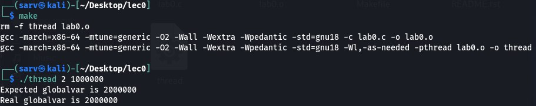
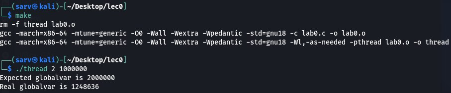
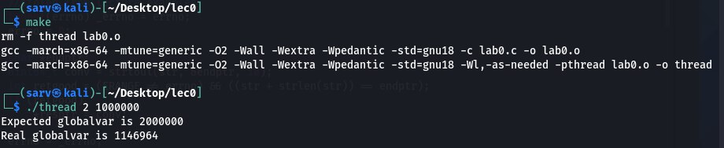
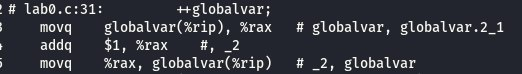

=============================================
=============================================
Лабораторна робота №0
=============================================

Тема
------

**Робота з потоками**

Завдання:
-------
Написати код в якому:
* Завести глобальну змінну з нульовим початковим значенням     
* Створити функцію потоку, яка N разів інкрементує змінну    
* Запустити N потоків з цією функцією     
* Дочекатися завершення потоків, використовуючи `pthread_join()`     
* Вивести у *stdout* очікуване і фактичне значення глобальної змінної     
       
Хід роботи
-------

В ході роботи було створено програму мовою С, яка задіюючи декілька потоків інкремендує число N разів. Потім зборку було виконано з різними параметрами оптимізації:

1) Оптимізація -O2

   
2) Оптимізація - O0

   
3) Оптимізація -О2 зі змінною типу volatile

З отриманих результатів видно, що коректний результат ми отримуємо лише з оптимізацією -О2.
Заглянувши в асемблерний лістинг програм, можна помітити, що при оптимізації -О2 компілятор для прискорення роботи програми замість того щоб N разів додавати 1, просто додає N.

Фрагмент асемблерного лістингу коду з -О0:

   
Фрагмент асемблерного лістингу коду з -О0:

    
Модифікатор volatile в свою чергу, забороняє оптимізувати змінну, що призводить фактично до такого ж результату як і при компіляції без оптимізації.

Висновки
-------
При виконанні компіляції програми з різними варіантами оптимізації отримуємо різні результати роботи програми (Використовуючи оптимізацію -О2 результат отримали вірний, а без оптимізації - ні). При роботі з потоками часто можна отримати некоректні дані через неатомарність інструкцій (тобто порушення послідовності зчитування, перетворення, запису одного потоку іншим), саме через це в даній лабораторній роботі отримані результати виконання функції інкременту виявились некоректними.

