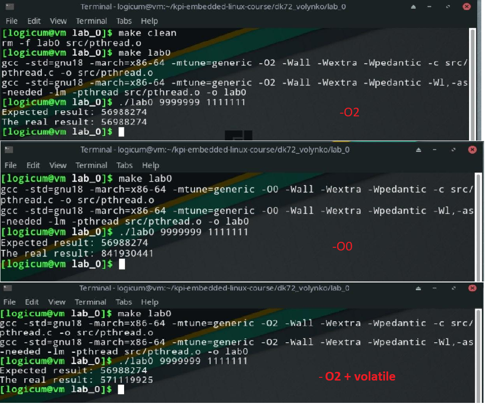

=================================================
**Лабораторна робота №0 Робота з потоками**
=================================================

**Завдання:**
--------------
Написати код в якому:

* Створити глобальну змінну та ініціалізувати її нулем;
* Створити функцію потоку,яка N разів додає до цієї змінної К;
* Запустити два потоки з цією функцією;
* Дочекатись завершення потоків використовуючи ``pthread_join()`` ;
* Вивести в ``stdout`` очікуване та фактичне значення глобальної змінної;

**Хід роботи:**
---------------

Для роботи з потоками було додано бібліотеку ``phtread.h``. Так як при створенні потоку, в поток можна передати
дані лише вказуючи вказівник на них, то для передачі двох параметрів ``n`` та ``k`` було створено структуру. Таким чином при 
створенні потоку ми вкажемо вказівник на створену змінну цієї структури, яка міститиме необхідні дані для передачі. 

Наступним кроком було створено фунцію, яка буде виконуватись в наших створених потоках. Дана функція виконує арифметичні дії 
з отриманими даними. За умовою вона повинна до глобальної змінної додавати N разів число К. При ініциалізації глобальній змінній
присвоєно значення нуля. 

Далі вже йде безпосередньо основна функція виконання програми ``main``. Вона складається з перевірки кількості змніних, що передані у програму.
Якщо кількість отриманих даних, не співпадає з очікуваним значенням, то виводиться текст, що кількість введених аргументів невірна. Потім іде
зчитування отриманих даних за допомогою функції  ``unsigned long int strtoul( const char * string, char ** endptr, int basis )``. Функція виконує 
перетворення рядка ``string`` в значення типу ``unsigned long int``. ``basis`` - це система числення в яку буде переведено рядок. 
Потім було створено цикли ``for`` для створення потоків та очікування закінчень потоків. І в завершенні було виведено отримані дані з розрахунків.

При виконанні даної лабораторної роботи, були використані функції із бібліотеки ``phtread.h``, а саме:
* ``pthread_t`` - ініціалізація потоку.
* ``pthread_create``- створює новий потік, в який передавались ініціалізація потоку, функція додавання числа К та структура з даними,
 які оброблялись в функції.
* ``pthread_join`` - очікує закінчення потоку і при успішному закінченні повертає нуль(якщо все було без помилок).
 

Перед зборкою даного коду, потрібно перш за все варто розібратися з компіляторором ``GCC``. Для  цього було розібрано
значення основних прапорців, які були використані при збірці цього проєкту:

* ``-march=x86-64:``  	Прапор проінструктує компілятор генерувати специфічний код для CPU,
			з усіма доступними можливостями, особливостями, наборами команд,
			функціями і так далі, за умови, що вихідний код їх підтримує.

* ``-mtune=generic`` 	Підстроює оптимізацію коду для усіх систем, які задані попереднім параметром,
			(у нашому випадку х86-64).

* ``-O2:``		Параметр оптимізації, компілятор спробує збільшити продуктивність коду 
			без порушення розміру, і без затрачивания великої кількості часу компіляції.

* ``-Wall`` 		Виводить усі попередження про конструкції, макроси і тому подібне.

* ``-Wextra``		Додатково вмикає прапорці попередження, які не були ввімкнуті попереднім параметром

* ``-Wpedantic``	Виводить усі попередження, які суворо залежать від ISO C. Усі програми,
			які використовують заборонені розширення будуть відхилені.

* ``-lm	``		Підключення бібліотеки математики.

Отриманий результат з використанням оптимізіції ``-O2``, без оптимізації ``-O0`` та при оптимізації ``-O2``
і з додаванням перед глобальною змінною слова ``volatile``:

**Висновок:**
---------

При компіляції проекту з прапорцем -О0(тобто оптимізація при зборці відсутня) значення до невеликої кількості N збігались.
При збільшенні цього параметру, а це означає що кількість разів додавання числа К виросло, почались розбіжності у результаті.

При компіляції проекту з прапорцем -О2(використовується другий рівень оптимізяції) значення були однакові, навіть при великій 
кількості додавань числа К. 

При додаванні ключового слова ``volatile`` знову ж таки результат не збігався з очікуваним значенням, тому що при використанні 
модифікатора ``volatile`` ми заставляємо програму звертатися до пам'яті кожен раз, коли звертаємось до цієї змінної, і виходить,
що ми заставляємо програму працювати в дійсності з ціє змінною.

Це все обумовлено тим, що при перегляді асемблер лістингу було виявлено, що додавання числа К відбувається у три етапи. 
При компіляції з -О0 суміжний потік може перехопити значення,прочитатистаре та додати число К. Потім управління знову 
перейде до першого потоку, який також додасть своє значення, зовсім не знаючи, що суміжний потік вже змінив змінну.

