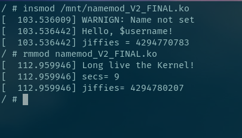
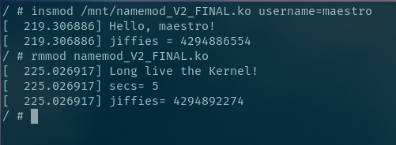

Лабораторна робота 1
======================

Завдання
--------
Зібрати ядро з BusyBox. Запустити на віртуальній машині.
Створити модуль який виводить значення змінної яке задається користувачем.
І значення ``jiffies``.
Якщо користувач не задає змінну то вивести попередження.
При видаленні модуля вивести теперішній ``jiffies`` і час роботи модуля в секундах.

Хід роботи
----------

Збірка Linux-ядра
~~~~~~~~~~~~~~~~~
Перед тим як збирати ядро потрібно його сконфігурувати.
Це робиться за допомогою ``make defconfig``.
Щоб запустити у вигляді програми меню ``make menuconfig``.
Щоб отримати повну інформацію ``make help``

Збираємо командою

.. code-block::

   $ make vmlinux

Також для віртуальної машини потрібно **bzImage**

Аналогічно як збірка ядра збираємо BusyBox.
BusyBox це збірка основних утиліт командного рядка які можна побачити в директорії ``/bin``.
Після після збірки ми отримаємо директорію *_install*.
В даній директорію потрібно створити файл **Init**.
Init процес це перший процес який запускає ядро після ініціалізації.
Після чого потрібно дану директорію архівувати. В кінці отримаємо ``initramfs.cpio.gz``

.. code-block::

   find . -print0 | cpio --null --owner=0:0 -ov --format=newc | gzip -9 > <direcory>/initramfs.cpio.gz

Запуск ядра
~~~~~~~~~~~~~~~~~~~
Для безпеки своєї системи зібране ядро запускаємо на віртуальній машині **Qemu**
Щоб запустити на архітектурі x86_64 використовуємо команду ``qemu-system-x86_64``

.. code-block::

   qemu-system-x86_64 -enable-kvm -m 256M -smp 4 -kernel "./bzImage" \
                      -initrd "./initramfs.cpio.gz" \
                      -append "console=ttyS0" -nographic \ -drive file=fat:rw:<directory>,format=raw,media=disk

* задамо ресурси для відтуальної машини. Оперативна пам'ять ``-m 256M`` і кількість потоків ``-smp 4``
* Далі вкажемо *bzImage* як образ ядра.  ``-kernel "./bzImage"``.
* Щоб запустити в терміналі, а не окремому вікні потрібно додати ``-append "console=ttyS0" -nographic``
* Також можна задати віртуальне диск ``-drive file=fat:rw:<directory>,format=raw,media=disk``. В результаті ми отримаємо ``/dev/sda1`` на віртуальній машині.

Збірка модуля ядра
~~~~~~~~~~~~~~~~~~
Після того як ядро було зібране потрібно зібрами модулі для цього потрібно виконати команду:

.. code-block::

   make modules

Для того щоб зібрати модуль потрібно исходник модуля і Makefile

Готовий Makefile_

.. _Makefile: ./Makefile

Робота з модулями ядра
~~~~~~~~~~~~~~~~~~~~~~
Щоб подивитися на список запущених модулів потрібно виконати команду:

.. code-block::

   # lsmod

Запуск модуля:

.. code-block::

   # insmod [filename] [param=""]

Видалення модуля з ядра Linux:

.. code-block::

   # rmmmod [namemod]

Результат
---------

Запуск модуля без вхідних параметрів

Запуск модуля з вхідних параметром *username*

Висновок
~~~~~~~~

Отже в даній роботі я навчився збирати Linux-ядро.
Його запускати у віртуальній машині.
Створювати модуль ядра і запускати модулі.
Використав функцію ``printk``.
Використав бібліотеку **jiffies** використав функцію ``jiffies_to_timespec64`` яка конвертує число в структуру ``jiffies_to_timespec64``.

