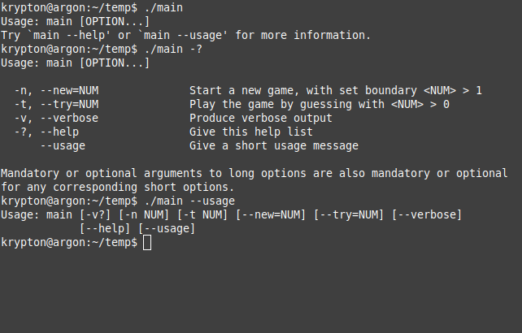
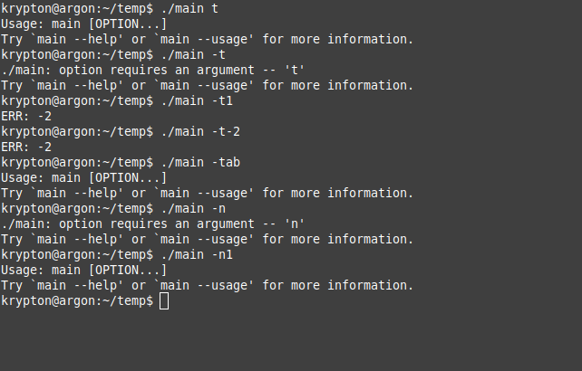
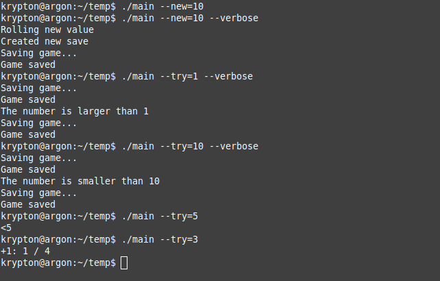

=============================
**Домашня контрольна робота**
=============================

**Завдання:**
~~~~~~~~~~~~~
Написати програму, що:

 - приймає аргументи з командного рядка. Для роботи з аргументами командного рядка використовувати **argp**;
 - збирається за допомогою **make**. *Makefile* містить додаткові цілі *build* та *clean*: *build* - являє собою ціль, що посилається на основну, а *clean* - PHONY-ціль, що очищує усі "артефакти", які генеруються підчас збирання проекту;
 - результат выводиться у **stdout**, помилки - в **stderr**;
 - частина службових функцій повинна бути винесена в окремий модуль *utils* (*utils.c* та *utils.h*);
 - використовуює опцію **--verbose (-v)**, що змушує програму виводити виконувані дії детальніше;
 - у разі успішного завершення повертає *exit code 0*, у разі неуспішного - код помилки. Помилки визначити як тип **enum**;
 - використовує об'єктний стиль для внутрішніх конструкцій, що реалізують основний функціонал програми;
 - програма реалізує гру "вгадай число". Користувач задає як аргумент власне число, потім програма генерує своє випадкове число (використовувати */dev/random*). Якщо числа співпали, користувач отримує +1 очко. В кінці кожної гри виводиться поточний рахунок користувача й кількість ігор. Між викликами програма зберігає свій стан в файлі в робочій директорії. Аргумент --new змушує програму почати гру наново.

**Хід роботи:**
~~~~~~~~~~~~~~~
 - Було створено *Makefile* із такими цілями:
    - **all** - основна ціль, посилається на ціль **build**;
    - **build** - ціль, що збирає проект;
	  - **clean** - ціль для очищення артефактів збірки, насамперед об'єктних файлів .o;
	  - **delsav** - ціль, що видаляє поточний файл де зберігаються ігрові дані; створена для зручності;
	  
 - Програма оформлена у вигляді декількох файлів:
 		- **main** - основна програма та обробка аргументів командного рядка;
 		- **rand** - модуль для генерації випадкових чисел за допомогою */dev/random*;
 		- **utils** - модуль у який винесено більшу частину ігрової логіки.
 - Програма дозволяє використання наступних аргументів командного рядка:
 		- **--new=[NUM] (-n[NUM])** - запуск нової гри та створення нового файлу для збереження ігрової інформації; приймає обов'язковий аргумент **NUM**, що задає верхню границю чисел, які будуть випадково генеруватися;
 		- **--try=[NUM] (-t[NUM])** - запуск гри; приймає обов'язковий аргумент **NUM** - число користувача;
 		- **--verbose (-v)** - виводить інформацію більш розгорнуто;

 - Також наявні стандартні опції **argp** такі як **--help (-?)**, **--usage**;
 - Результати роботи програми виводяться у **stdout**, а будь які наявні помилки у **stderr**.

**Результат**
~~~~~~~~~~~~~

Запуск без аргументів та запуск зі стандартними **--help (-?)**, **--usage**:
 

   
Запуск із некорректними аргументами **--new (-n)**, **--try (-t)**:
 

   
Запуск із корректними аргументами **--new (-n)**, **--try (-t)** і **--verbose (-v)**:
 

   
   