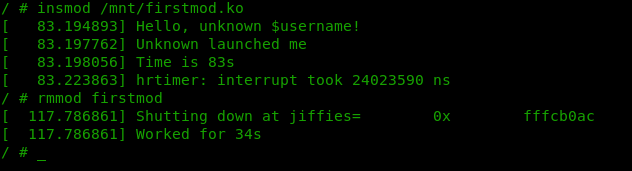
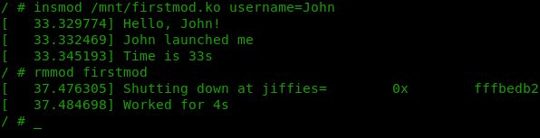

============================================================
**Лабораторна робота №1. Введення в розробку модулів ядра.**
============================================================

**Завдання:**
~~~~~~~~~~~~~
* виконати збірку мінімального Linux-ядра;
* зібрати мінімальне Linux-оточення з використання BusyBox;
* написати та зібрати власний модуль ядра на основі прикладу з ``demo/lab1/``:
    * модуль повинен мати вхідний параметр ``username``, який виводиться під час ініціалізації модуля ``<modulename>_init``; у випадку відсутності переданого параметру - вивести попередження;
    * при вивантаженні модуля ``<modulename>_exit``, вивести час який пройшов з моменту ініціалізації модуля - від *init* до *exit*.

**Хід роботи:**
~~~~~~~~~~~~~~~

**Використані макроси та функції:**

``module_param`` - використовується для визначення вхідних параметрів модуля;

``jiffies_delta_to_msecs`` - використовується для розрахунку проміжку часу. Очікує різницю між двома значеннями *jiffies* як вхідний аргумент;

``cstamp_delta`` - використовується для розрахунку поточного моменту часу. Очікує поточне значення *jiffies* як вхідний аргумент;

``printk`` - стандартний інструмент для друку повідомлень. В грубому наближенні є фактично аналогічним стандартному *printf*, але доповнений специфічним для ядра форматуванням;

``jiffies`` - глобальна змінна, яка відслідковує кількість тактів, що сталися з моменту завантаження системи.

**Висновки**
~~~~~~~~~~~~

Отримано мінімальне працююче linux-ядро та мінімальний набір стандартних Unix-like утиліт. Для емуляції ядра використовувався qemu.

Написано простий модуль на основі наведеного прикладу. Нижче приведено результати роботи модулю без передачі параметра *username* та з. При ініціалізації модуль також виводить поточний час у секундах, а при вивантаженні - час роботи та повне 64-х бітне значення *jiffies* на момент ініціалізації.

Нажаль спіймати на скріншоті момент коли видно, що значення дійсно 64-х бітне не вдалося.

   
