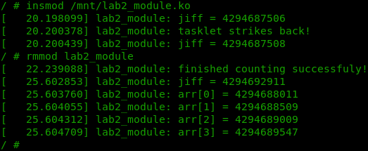
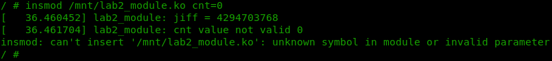
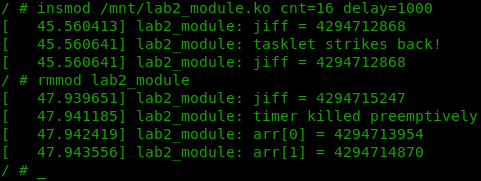

============================================================
**Лабораторна робота №2. Tasklets. High resolution timers.**
============================================================

**Завдання:**
~~~~~~~~~~~~~
Написати модуль який приймає два аргументи: **cnt**, **delay**.

При ініціалізації (*module_init*) модуль виводить значення *jiffies*, створює масив розміром **cnt**, запускає *tasklet* який виводить значення *jiffies* та запускає *hrtimer* із затримкою **delay** мс, що записує **cnt** значень *jiffies* у масив.
При розвантаженні модуль знову виводить значення *jiffies* та друкує отриманий масив.

Передбачити можливість завчасного розвантаження.

**Хід роботи:**
~~~~~~~~~~~~~~~

**tasklets**

Для того щоб створити *tasklet* необхідно:

- створити callback-функцію обробник;
-	використати макрос `DECLARE_TASKLET`

АБО

- ініціалізувати tasklet вручну за допомогою об'явлення структури `struct tasklet_struct <name>` та функції `tasklet_init`;

Далі можемо "запланувати" виконання *tasklet*'у за допомогою `tasklet_schedule`.

**hrtimers**

Для створення *hrtimer*'у необхідно:

- оголосити структуру `struct hrtimer <name>`;
- оголосити функцію-обробник типу `enum hrtimer_restart <function_name>(struct hrtimer *timer)`;
- ініціалізувати оголошену раніше структуру за допомогою `hrtimer_init`;

Наступним кроком можемо запустити таймер функцією `hrtimer_start` і перезапускати за допомогою, наприклад, `hrtimer_forward_now`, передаючи у якості другого параметру час спрацювання у форматі *ktime_t*. Для зручності можна скористатися, наприклад, функцією `ms_to_ktime`.

**Результат**
~~~~~~~~~~~~~

При нормальному режимі роботи модуль виводить значення *jiffies* при завантаженні, вивантаженні та при спрацюванні *tasklet*'у. При вивантаженні також виводиться відповідне повідомлення про успішне заповнення массиву та сам масив.

Стандартні значення **cnt** та **delay** рівні 4 та 500 відповідно.

   
Якщо спробувати передати у модуль **cnt** або **delay** рівні 0, модуль не завантажиться та видасть наступну помилку:
   

   
Якщо завчасно вивантажити модуль виведеться відповідне повідомлення та ті елементи массиву які вдалося записати:  
 
