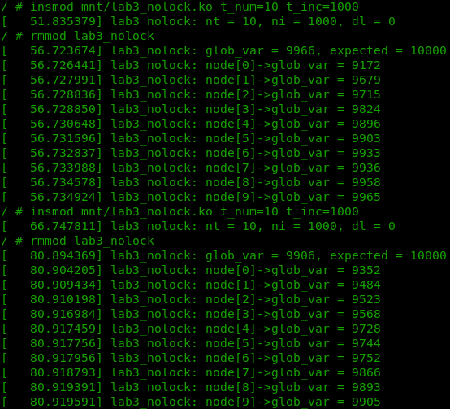
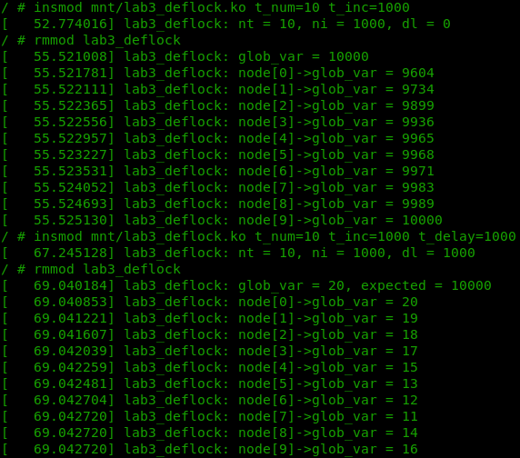
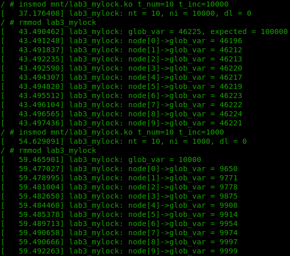

============================================================
**Лабораторна робота №3. Kernel Threads**
============================================================

**Завдання:**
~~~~~~~~~~~~~
Написати модуль який:
 - містить глобальну змінну **glob_var**;
 - приймає три аргументи: 
 		- **thread_num** - кількість потоків для одночасного виконання;
 		- **thread_inccnt** - кількість інкрементів **glob_var** для кожного потоку;
 		- **thread_delay** - затримка між кожним інкрементом **glob_var** у потоці;
 - запускає **thread_num** потоків на одночасне виконання;
 - кожен потік інкрементує змінну **glob_var** **thread_inccnt** разів з затримкою **thread_delay** (в випадку **thread_delay** = 0 - без затримки), додає значення змінної **glob_var** до списку і завершується;
 - при вивантажені модуль виводить значення **glob_var** та вміст списку;
 - для змінних, списку та потоків використовувати динамічну аллокацію; змінну передавати в потік в якості аргументу;
 - передбачити можливість завчасного вивантаження.

**Хід роботи:**
~~~~~~~~~~~~~~~

**kthreads**

 - Об'являємо масив структур типу *task_struct* та виділяємо пам'ять під даний масив згідно з вхідними аргументами.

 - За допомогою функції **kthread_run** запускаємо необхідну кількість потоків, передаючи в якості основних аргументів callback потоку та аргументи до неї.

 - Після виконання необхідних дій, завершуємо потік функцією **kthread_stop**.

 - Для перевірки завершення потоку, у callback застосовуємо функцію **kthread_should_stop**.
 
**mutex**

 - За допомогою макросу *DEFINE_MUTEX* створюємо змінну для відслідковування стану доступності ресурсу.
 
 - **mutex_lock** - блокуємо доступ до ресурсу.
 
 - **mutex_unlock** - дозволяємо доступ до ресурсу.

**lists**

 - За допомогою макросу *LIST_HEAD* створюємо структуру типу *list_head*, що слугує початком списку.
 
 - **list_add_tail** - додає елемент у кінець списку;
 
 - *list_for_each_entry* - макрос, що дозволяє легко ітеруватися по елементах списку.
 
 - *list_for_each_entry_safe* - аналогічний *list_for_each_entry*, з тим виключенням, що дозволяє видалення поточного елементу зі списку.

**Результат**
~~~~~~~~~~~~~

**nolock**

Стандартний механізм mutex ядра використовується лише для додавання елементу до списку. Як видно із зображення нижче, в такому випадку кінцеве значення **glob_var** некоректне.

   
**deflock**

Застосування стандартного mutex для інкрементації **glob_var** та додавання елементу до списку дає коректне кінцеве значення.
   

**mylock**   

Власна реалізація mutex за допомогою атомарних операцій також дає коректний результат.
 
